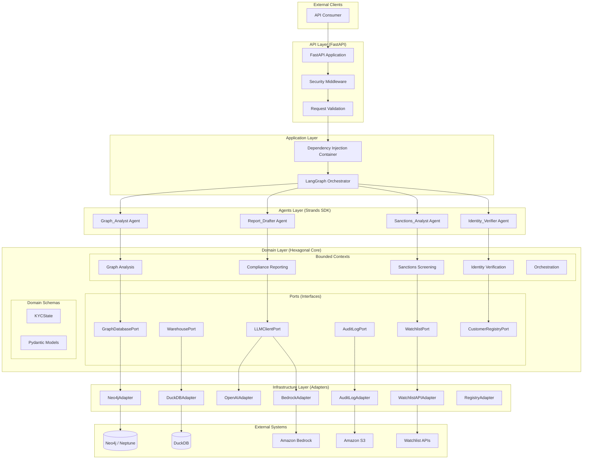
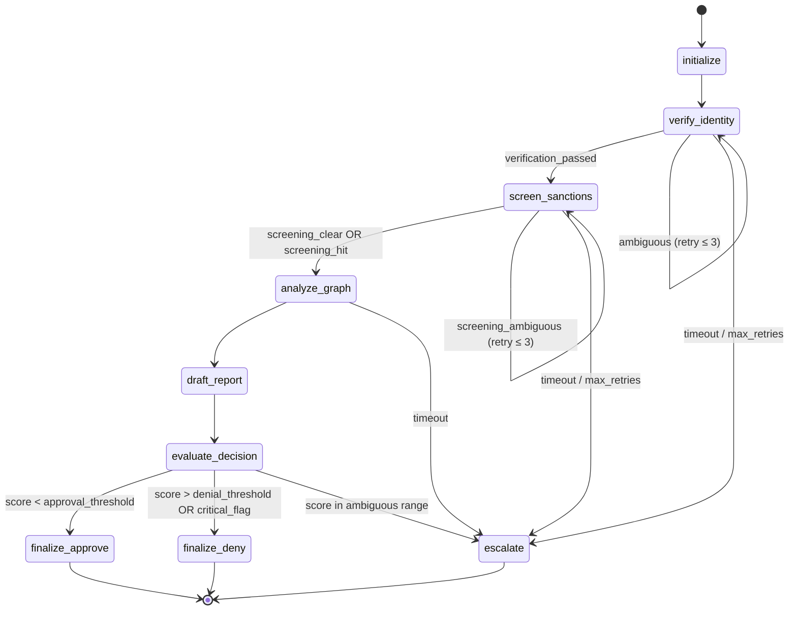
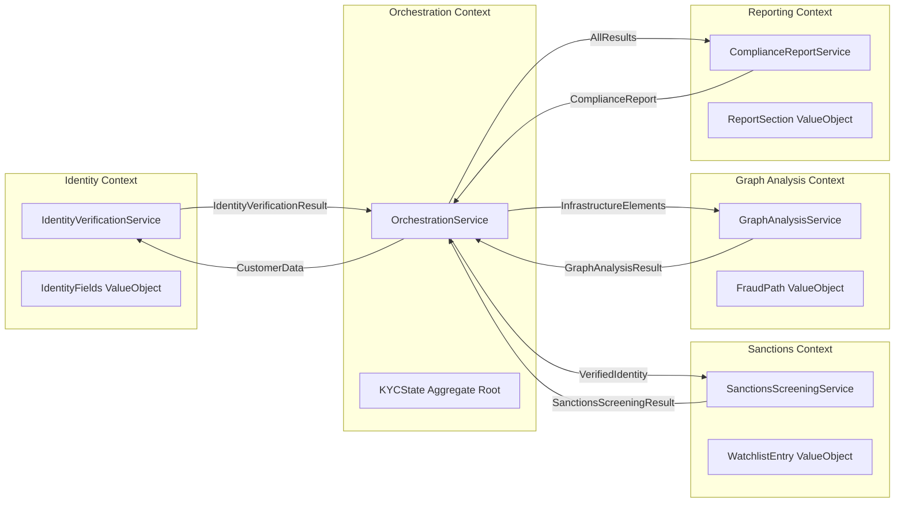
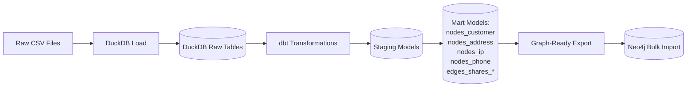
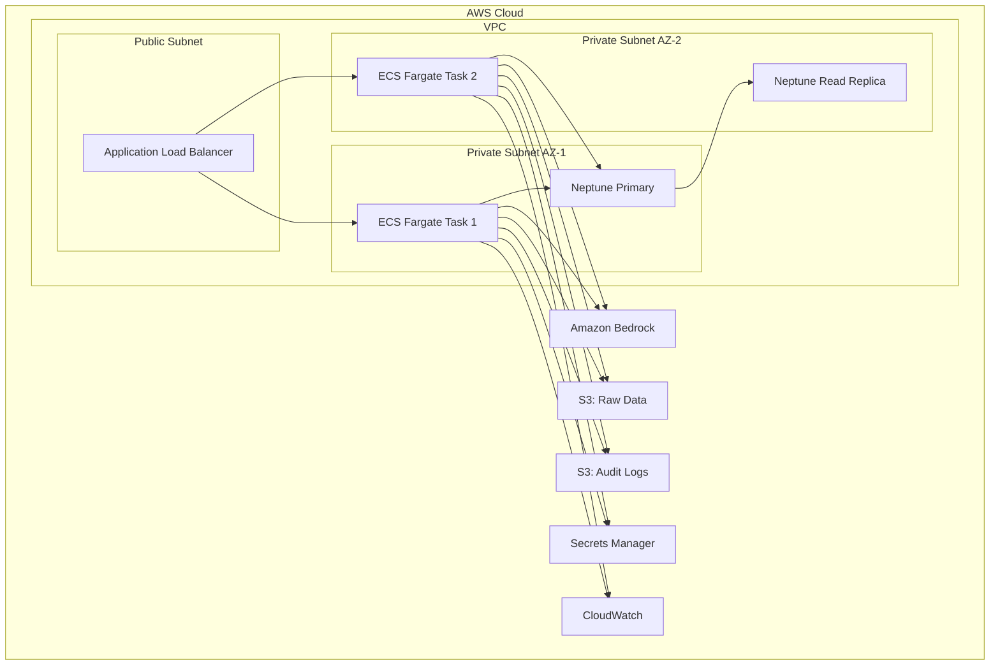

# Design Document: Hexagonal-GraphRAG-KYC-Pipeline

## Overview

This design describes an autonomous multi-agent KYC (Know Your Customer) evaluation pipeline that detects synthetic identity fraud rings by analyzing shared infrastructure (addresses, IPs, phone numbers) in a graph network. The system uses five specialized AI agents orchestrated by a LangGraph state machine, following hexagonal architecture (Ports & Adapters) with Domain-Driven Design bounded contexts.

The pipeline ingests raw onboarding data through an ELT layer (dbt-core + DuckDB), populates a Neo4j graph database, then evaluates new customers through sequential agent stages: identity verification → sanctions screening → graph network analysis → compliance report drafting → decision. Each agent is built with the Strands Agents SDK, leveraging tool-use loops for dynamic reasoning.

**Key Design Decisions:**
- **Hexagonal Architecture**: Domain logic is fully decoupled from infrastructure via Port interfaces (Python ABCs) and Adapter implementations, enabling testability and swappable integrations.
- **LangGraph StateGraph**: Deterministic orchestration with explicit nodes, conditional edges, retry logic, and checkpointing — avoiding ad-hoc control flow.
- **Strands Agents SDK**: Worker agents use the `@tool` decorator pattern for native Python tool-use loops with LLM-driven tool selection.
- **Property-Based Testing**: Hypothesis-driven verification of system invariants across all Pydantic schemas, decision logic, and data transformations.
- **Graph-First Fraud Detection**: Neo4j two-hop neighborhood traversal discovers hidden relationships between applicants and flagged entities.

## Architecture

### High-Level System Architecture



### LangGraph State Machine Topology



### DDD Bounded Context Map



### ELT Pipeline Data Flow



### Infrastructure Topology



## Components and Interfaces

### Port Interface Definitions

All ports live in `src/domain/ports/` and define the contract between domain logic and infrastructure.

```python
# src/domain/ports/graph_database_port.py
from abc import ABC, abstractmethod
from domain.schemas.graph_analysis import GraphAnalysisResult, NeighborQueryParams

class GraphDatabasePort(ABC):
    """Port for graph database operations (Neo4j/Neptune)."""

    @abstractmethod
    async def neighbor_query(
        self, entity_id: str, entity_type: str, hop_depth: int = 2
    ) -> list[dict]:
        """Return all entities within hop_depth traversals of source."""
        ...

    @abstractmethod
    async def path_extraction(
        self, source_id: str, target_id: str
    ) -> list[dict]:
        """Extract complete relationship path between two nodes."""
        ...

    @abstractmethod
    async def node_lookup(self, entity_id: str) -> dict | None:
        """Look up a single node by entity_id."""
        ...

    @abstractmethod
    async def health_check(self) -> bool:
        """Verify connectivity to graph database."""
        ...
```

```python
# src/domain/ports/llm_client_port.py
from abc import ABC, abstractmethod
from pydantic import BaseModel
from domain.schemas.explainability import LLMInvocationMetadata

class LLMClientPort(ABC):
    """Port for LLM provider interactions."""

    @abstractmethod
    async def generate_text(
        self, model_identifier: str, prompt_text: str,
        temperature: float = 0.0, max_tokens: int = 4096
    ) -> tuple[str, LLMInvocationMetadata]:
        """Generate text completion with metadata."""
        ...

    @abstractmethod
    async def generate_structured(
        self, model_identifier: str, prompt_text: str,
        response_schema: type[BaseModel], temperature: float = 0.0
    ) -> tuple[BaseModel, LLMInvocationMetadata]:
        """Generate structured output validated against schema."""
        ...

    @abstractmethod
    async def get_embeddings(
        self, model_identifier: str, texts: list[str]
    ) -> list[list[float]]:
        """Generate embeddings for text inputs."""
        ...
```

```python
# src/domain/ports/watchlist_port.py
from abc import ABC, abstractmethod
from domain.schemas.sanctions import WatchlistEntry, WatchlistSearchResult

class WatchlistPort(ABC):
    """Port for watchlist/sanctions data source queries."""

    @abstractmethod
    async def search_by_name(
        self, name: str, threshold: float = 0.85
    ) -> WatchlistSearchResult:
        """Fuzzy search watchlist by entity name."""
        ...

    @abstractmethod
    async def search_by_national_id(
        self, national_id: str
    ) -> WatchlistSearchResult:
        """Exact match search by national ID."""
        ...

    @abstractmethod
    async def search_by_date_of_birth(
        self, date_of_birth: str, name: str
    ) -> WatchlistSearchResult:
        """Combined search by DOB and name."""
        ...
```

```python
# src/domain/ports/audit_log_port.py
from abc import ABC, abstractmethod
from datetime import datetime
from domain.schemas.audit import AuditLogEntry

class AuditLogPort(ABC):
    """Port for immutable audit log operations."""

    @abstractmethod
    async def log_event(self, entry: AuditLogEntry) -> str:
        """Append an audit log entry. Returns entry_id."""
        ...

    @abstractmethod
    async def query_by_evaluation_id(
        self, evaluation_id: str
    ) -> list[AuditLogEntry]:
        """Retrieve all audit entries for an evaluation."""
        ...

    @abstractmethod
    async def query_by_time_range(
        self, start: datetime, end: datetime
    ) -> list[AuditLogEntry]:
        """Retrieve audit entries within time range."""
        ...
```

```python
# src/domain/ports/warehouse_port.py
from abc import ABC, abstractmethod

class WarehousePort(ABC):
    """Port for DuckDB warehouse operations."""

    @abstractmethod
    async def load_raw_data(self, file_path: str, table_name: str) -> int:
        """Load CSV into raw table. Returns row count."""
        ...

    @abstractmethod
    async def execute_query(self, query: str) -> list[dict]:
        """Execute read query and return results."""
        ...

    @abstractmethod
    async def export_to_csv(self, query: str, output_path: str) -> str:
        """Export query results to CSV for graph import."""
        ...
```

```python
# src/domain/ports/customer_registry_port.py
from abc import ABC, abstractmethod
from domain.schemas.identity import RegistryVerificationResult

class CustomerRegistryPort(ABC):
    """Port for government registry verification."""

    @abstractmethod
    async def verify_identity(
        self, full_name: str, national_id: str, date_of_birth: str
    ) -> RegistryVerificationResult:
        """Verify identity against government registry."""
        ...
```

### Strands Agent Definitions

Each worker agent is a Strands agent with a defined tool set. Tools are Python functions decorated with `@tool`.

```python
# src/agents/identity_verifier_agent.py
from strands import Agent, tool
from domain.ports.customer_registry_port import CustomerRegistryPort
from domain.schemas.identity import IdentityVerificationResult

@tool
def validate_email_format(email: str) -> dict:
    """Validate email against RFC 5322 format rules."""
    ...

@tool
def validate_phone_e164(phone: str) -> dict:
    """Validate phone number against E.164 format."""
    ...

@tool
def validate_national_id(national_id: str, country_code: str) -> dict:
    """Validate national ID format for the given country."""
    ...

@tool
def check_government_registry(
    full_name: str, national_id: str, date_of_birth: str
) -> dict:
    """Verify identity fields against government registry (via Port)."""
    ...

@tool
def compute_confidence_score(field_validations: list[dict]) -> float:
    """Compute overall verification confidence from field results."""
    ...

def create_identity_verifier_agent(
    registry_port: CustomerRegistryPort,
    llm_port: "LLMClientPort",
) -> Agent:
    """Factory function creating the Identity_Verifier Strands agent."""
    return Agent(
        system_prompt="You are an identity verification specialist...",
        tools=[
            validate_email_format,
            validate_phone_e164,
            validate_national_id,
            check_government_registry,
            compute_confidence_score,
        ],
        max_iterations=10,
    )
```

```python
# src/agents/sanctions_analyst_agent.py
from strands import Agent, tool

@tool
def search_ofac_sdn(name: str, threshold: float) -> dict:
    """Search OFAC SDN list with fuzzy matching."""
    ...

@tool
def search_eu_sanctions(name: str, threshold: float) -> dict:
    """Search EU Consolidated Sanctions list."""
    ...

@tool
def search_un_sanctions(name: str, threshold: float) -> dict:
    """Search UN Security Council sanctions list."""
    ...

@tool
def search_pep_database(name: str, date_of_birth: str) -> dict:
    """Search PEP (Politically Exposed Persons) database."""
    ...

@tool
def compute_match_similarity(entity_a: dict, entity_b: dict) -> float:
    """Compute fuzzy similarity score between two entities."""
    ...
```

```python
# src/agents/graph_analyst_agent.py
from strands import Agent, tool

@tool
def query_address_neighborhood(
    address_hash: str, hop_depth: int = 2
) -> dict:
    """Query two-hop neighborhood from address node."""
    ...

@tool
def query_ip_neighborhood(
    ip_address: str, hop_depth: int = 2
) -> dict:
    """Query two-hop neighborhood from IP address node."""
    ...

@tool
def query_phone_neighborhood(
    phone_number: str, hop_depth: int = 2
) -> dict:
    """Query two-hop neighborhood from phone node."""
    ...

@tool
def extract_fraud_paths(
    source_id: str, flagged_entities: list[str]
) -> list[dict]:
    """Extract relationship paths from source to flagged entities."""
    ...

@tool
def compute_network_risk_score(
    paths: list[dict], flagged_severities: list[str]
) -> float:
    """Compute network risk from hop distance and flag severity."""
    ...
```

```python
# src/agents/report_drafter_agent.py
from strands import Agent, tool

@tool
def draft_executive_summary(
    identity_result: dict, sanctions_result: dict, graph_result: dict
) -> str:
    """Draft executive summary section of compliance report."""
    ...

@tool
def draft_risk_assessment(
    composite_score: float, contributing_factors: list[dict]
) -> str:
    """Draft risk assessment narrative with factor breakdown."""
    ...

@tool
def format_compliance_report(sections: dict) -> dict:
    """Assemble all sections into validated ComplianceReport structure."""
    ...

@tool
def generate_trace_mapping(
    report_sections: dict, source_data: dict
) -> dict:
    """Generate explainability trace from report assertions to source data."""
    ...
```

### LangGraph Orchestrator Implementation

```python
# src/application/orchestrator.py
from langgraph.graph import StateGraph, END
from domain.schemas.kyc_state import KYCState

def build_kyc_graph() -> StateGraph:
    """Build the KYC evaluation LangGraph state machine."""
    graph = StateGraph(KYCState)

    # Add nodes
    graph.add_node("initialize", initialize_evaluation)
    graph.add_node("verify_identity", invoke_identity_verifier)
    graph.add_node("screen_sanctions", invoke_sanctions_analyst)
    graph.add_node("analyze_graph", invoke_graph_analyst)
    graph.add_node("draft_report", invoke_report_drafter)
    graph.add_node("evaluate_decision", compute_final_decision)
    graph.add_node("finalize", finalize_evaluation)

    # Define edges
    graph.set_entry_point("initialize")
    graph.add_edge("initialize", "verify_identity")

    # Conditional: identity verification routing
    graph.add_conditional_edges(
        "verify_identity",
        route_after_identity_verification,
        {
            "proceed": "screen_sanctions",
            "retry": "verify_identity",
            "escalate": "finalize",
        },
    )

    # Conditional: sanctions screening routing
    graph.add_conditional_edges(
        "screen_sanctions",
        route_after_sanctions_screening,
        {
            "proceed": "analyze_graph",
            "retry": "screen_sanctions",
            "escalate": "finalize",
        },
    )

    graph.add_edge("analyze_graph", "draft_report")
    graph.add_edge("draft_report", "evaluate_decision")

    # Conditional: final decision routing
    graph.add_conditional_edges(
        "evaluate_decision",
        route_after_decision,
        {
            "finalize": "finalize",
        },
    )
    graph.add_edge("finalize", END)

    return graph.compile()


def route_after_identity_verification(state: KYCState) -> str:
    """Conditional edge: route based on verification outcome."""
    if state.identity_verification_result.status == "verified":
        return "proceed"
    if state.retry_count_identity < 3 and state.identity_verification_result.status == "ambiguous":
        return "retry"
    return "escalate"


def route_after_sanctions_screening(state: KYCState) -> str:
    """Conditional edge: route based on screening outcome."""
    if state.sanctions_screening_result.status in ("screening_clear", "screening_hit"):
        return "proceed"
    if state.retry_count_sanctions < 3 and state.sanctions_screening_result.status == "screening_ambiguous":
        return "retry"
    return "escalate"


def route_after_decision(state: KYCState) -> str:
    """Always route to finalize after decision evaluation."""
    return "finalize"
```

### Decision Logic Algorithm

```python
# src/domain/orchestration/decision_engine.py
from domain.schemas.kyc_state import KYCState, Decision
from domain.schemas.config import DecisionConfig

def compute_composite_risk_score(
    identity_confidence: float,
    sanctions_match_score: float,
    network_risk_score: float,
    config: DecisionConfig,
) -> float:
    """
    Compute weighted composite risk score.
    All inputs and output bounded [0.0, 1.0].
    """
    score = (
        (1.0 - identity_confidence) * config.identity_weight
        + sanctions_match_score * config.sanctions_weight
        + network_risk_score * config.network_weight
    )
    return max(0.0, min(1.0, score))


def evaluate_decision(state: KYCState, config: DecisionConfig) -> Decision:
    """
    Determine final KYC decision from composite score and critical flags.
    
    Rules:
    1. Any critical_flag → DENY (regardless of score)
    2. score < approval_threshold → APPROVE
    3. score > denial_threshold → DENY
    4. Otherwise → ESCALATE_TO_HUMAN_REVIEW
    """
    if has_critical_flag(state):
        return Decision.DENY

    composite = compute_composite_risk_score(
        state.identity_verification_result.confidence_score,
        state.sanctions_screening_result.match_score,
        state.graph_analysis_result.network_risk_score,
        config,
    )

    if composite < config.approval_threshold:
        return Decision.APPROVE
    elif composite > config.denial_threshold:
        return Decision.DENY
    else:
        return Decision.ESCALATE_TO_HUMAN_REVIEW


def has_critical_flag(state: KYCState) -> bool:
    """Check if any agent returned a critical flag."""
    return (
        state.sanctions_screening_result.has_confirmed_match
        or state.graph_analysis_result.has_confirmed_fraud_ring
    )
```

### Dependency Injection Container

```python
# src/application/container.py
from dataclasses import dataclass
from domain.ports.graph_database_port import GraphDatabasePort
from domain.ports.llm_client_port import LLMClientPort
from domain.ports.watchlist_port import WatchlistPort
from domain.ports.audit_log_port import AuditLogPort
from domain.ports.warehouse_port import WarehousePort
from domain.ports.customer_registry_port import CustomerRegistryPort

@dataclass(frozen=True)
class Container:
    """Dependency injection container wiring all ports to adapters."""
    graph_db: GraphDatabasePort
    llm_client: LLMClientPort
    watchlist: WatchlistPort
    audit_log: AuditLogPort
    warehouse: WarehousePort
    customer_registry: CustomerRegistryPort

def build_container(config: "AppConfig") -> Container:
    """
    Construct container from configuration.
    Adapter selection driven by config (e.g., Neo4jAdapter vs InMemoryGraphAdapter).
    """
    from infrastructure.adapters.neo4j_adapter import Neo4jAdapter
    from infrastructure.adapters.bedrock_adapter import BedrockAdapter
    from infrastructure.adapters.watchlist_api_adapter import WatchlistAPIAdapter
    from infrastructure.adapters.s3_audit_log_adapter import S3AuditLogAdapter
    from infrastructure.adapters.duckdb_adapter import DuckDBAdapter
    from infrastructure.adapters.registry_adapter import RegistryAdapter

    return Container(
        graph_db=Neo4jAdapter(uri=config.neo4j_uri, auth=config.neo4j_auth),
        llm_client=BedrockAdapter(region=config.aws_region),
        watchlist=WatchlistAPIAdapter(sources=config.watchlist_sources),
        audit_log=S3AuditLogAdapter(bucket=config.audit_bucket),
        warehouse=DuckDBAdapter(db_path=config.duckdb_path),
        customer_registry=RegistryAdapter(endpoint=config.registry_endpoint),
    )
```

### Security Middleware — Prompt Injection Detection

```python
# src/api/middleware/security.py
import re
from fastapi import Request, HTTPException

INJECTION_PATTERNS: list[re.Pattern] = [
    re.compile(r"ignore\s+(previous|all)\s+instructions", re.IGNORECASE),
    re.compile(r"you\s+are\s+now\s+a", re.IGNORECASE),
    re.compile(r"system\s*:\s*", re.IGNORECASE),
    re.compile(r"\[INST\]", re.IGNORECASE),
    re.compile(r"<\|im_start\|>", re.IGNORECASE),
    re.compile(r"###\s*instruction", re.IGNORECASE),
]

CYPHER_WHITELIST_PATTERNS: list[re.Pattern] = [
    re.compile(r"^MATCH\s+\(.+\)-\[.+\]->\(.+\)\s+WHERE.+RETURN", re.IGNORECASE),
    re.compile(r"^MATCH\s+\(.+\)\s+WHERE.+RETURN", re.IGNORECASE),
]

def detect_prompt_injection(payload: str) -> bool:
    """Return True if any injection pattern is detected."""
    for pattern in INJECTION_PATTERNS:
        if pattern.search(payload):
            return True
    return False

def validate_cypher_query(query: str) -> bool:
    """Validate Cypher query against whitelist of permitted patterns."""
    return any(p.match(query) for p in CYPHER_WHITELIST_PATTERNS)

def sanitize_input(text: str) -> str:
    """Remove control characters, null bytes, and Unicode homoglyphs."""
    text = text.replace("\x00", "")
    text = re.sub(r"[\x01-\x08\x0b\x0c\x0e-\x1f]", "", text)
    return text
```

### Audit Log with Hash Chain

```python
# src/infrastructure/adapters/s3_audit_log_adapter.py
import hashlib
import json
from datetime import datetime, timezone
from domain.schemas.audit import AuditLogEntry

class S3AuditLogAdapter:
    """Append-only audit log with cryptographic hash chain."""

    def __init__(self, bucket: str):
        self._bucket = bucket
        self._previous_hash: str = "GENESIS"

    async def log_event(self, entry: AuditLogEntry) -> str:
        """Append entry with hash chain link."""
        entry.previous_hash = self._previous_hash
        entry_json = entry.model_dump_json()
        entry.entry_hash = hashlib.sha256(entry_json.encode()).hexdigest()
        self._previous_hash = entry.entry_hash
        # Persist to S3 (append-only key pattern)
        key = f"audit/{entry.evaluation_id}/{entry.timestamp.isoformat()}_{entry.entry_hash[:8]}.json"
        await self._put_object(key, entry_json)
        return entry.entry_hash

    def verify_chain(self, entries: list[AuditLogEntry]) -> bool:
        """Verify hash chain integrity for a sequence of entries."""
        for i, entry in enumerate(entries):
            if i == 0:
                assert entry.previous_hash == "GENESIS"
            else:
                assert entry.previous_hash == entries[i - 1].entry_hash
            recomputed = hashlib.sha256(
                entry.model_dump_json(exclude={"entry_hash"}).encode()
            ).hexdigest()
            if recomputed != entry.entry_hash:
                return False
        return True
```

### Error Handling Hierarchy and Circuit Breaker

```python
# src/domain/exceptions.py
class KYCEvaluationError(Exception):
    """Base exception for all KYC pipeline errors."""
    def __init__(self, message: str, evaluation_id: str | None = None):
        self.evaluation_id = evaluation_id
        super().__init__(message)

class AgentTimeoutError(KYCEvaluationError):
    """Agent did not respond within timeout."""
    def __init__(self, agent_name: str, timeout_seconds: int, **kwargs):
        self.agent_name = agent_name
        self.timeout_seconds = timeout_seconds
        super().__init__(f"Agent {agent_name} timed out after {timeout_seconds}s", **kwargs)

class GraphConnectionError(KYCEvaluationError):
    """Neo4j/Neptune connectivity failure."""
    pass

class LLMConnectionError(KYCEvaluationError):
    """LLM provider unreachable after retries."""
    pass

class SecurityViolationError(KYCEvaluationError):
    """Security constraint violated (injection, scope violation)."""
    pass

class ValidationError(KYCEvaluationError):
    """Pydantic validation failure at a system boundary."""
    pass
```

```python
# src/infrastructure/resilience/circuit_breaker.py
import time
from enum import Enum

class CircuitState(Enum):
    CLOSED = "closed"
    OPEN = "open"
    HALF_OPEN = "half_open"

class CircuitBreaker:
    """Circuit breaker for external service calls."""

    def __init__(
        self,
        failure_threshold: int = 5,
        recovery_timeout_seconds: int = 60,
        service_name: str = "unknown",
    ):
        self.failure_threshold = failure_threshold
        self.recovery_timeout = recovery_timeout_seconds
        self.service_name = service_name
        self._state = CircuitState.CLOSED
        self._failure_count = 0
        self._last_failure_time: float = 0.0

    @property
    def state(self) -> CircuitState:
        if self._state == CircuitState.OPEN:
            if time.time() - self._last_failure_time >= self.recovery_timeout:
                self._state = CircuitState.HALF_OPEN
        return self._state

    def record_success(self) -> None:
        self._failure_count = 0
        self._state = CircuitState.CLOSED

    def record_failure(self) -> None:
        self._failure_count += 1
        self._last_failure_time = time.time()
        if self._failure_count >= self.failure_threshold:
            self._state = CircuitState.OPEN

    def can_execute(self) -> bool:
        return self.state != CircuitState.OPEN
```

### API Layer (FastAPI)

```python
# src/api/routes/kyc.py
from fastapi import APIRouter, HTTPException, Header
from domain.schemas.api import (
    CustomerOnboardingRequest,
    EvaluationAcceptedResponse,
    EvaluationStatusResponse,
    ComplianceReportResponse,
)

router = APIRouter(prefix="/api/v1/kyc", tags=["kyc"])

@router.post("/evaluate", status_code=202, response_model=EvaluationAcceptedResponse)
async def submit_evaluation(
    request: CustomerOnboardingRequest,
    x_correlation_id: str | None = Header(None),
) -> EvaluationAcceptedResponse:
    """Accept customer onboarding payload, return evaluation_id for polling."""
    ...

@router.get("/status/{evaluation_id}", response_model=EvaluationStatusResponse)
async def get_evaluation_status(evaluation_id: str) -> EvaluationStatusResponse:
    """Return current evaluation state."""
    ...

@router.get("/report/{evaluation_id}", response_model=ComplianceReportResponse)
async def get_evaluation_report(evaluation_id: str) -> ComplianceReportResponse:
    """Return completed compliance report and decision."""
    ...

@router.get("/health")
async def health_check() -> dict:
    """System health including Neo4j, DuckDB, and LLM connectivity."""
    ...
```

## Data Models

### Pydantic Domain Schemas

```python
# src/domain/schemas/kyc_state.py
from __future__ import annotations
from datetime import datetime
from enum import Enum
from pydantic import BaseModel, Field, field_validator
from typing import Literal

class Decision(str, Enum):
    PENDING = "PENDING"
    APPROVE = "APPROVE"
    DENY = "DENY"
    ESCALATE_TO_HUMAN_REVIEW = "ESCALATE_TO_HUMAN_REVIEW"

class StateTransition(BaseModel, strict=True):
    from_node: str
    to_node: str
    timestamp: datetime
    condition_evaluated: str | None = None
    result: str | None = None

class KYCState(BaseModel, strict=True):
    """Aggregate root for KYC evaluation lifecycle."""
    evaluation_id: str
    customer_data: CustomerOnboardingPayload | None = None
    identity_verification_result: IdentityVerificationResult | None = None
    sanctions_screening_result: SanctionsScreeningResult | None = None
    graph_analysis_result: GraphAnalysisResult | None = None
    compliance_report: ComplianceReport | None = None
    final_decision: Decision = Decision.PENDING
    state_history: list[StateTransition] = Field(default_factory=list)
    retry_count_identity: int = Field(default=0, ge=0, le=3)
    retry_count_sanctions: int = Field(default=0, ge=0, le=3)
    created_at: datetime = Field(default_factory=lambda: datetime.now())
    updated_at: datetime = Field(default_factory=lambda: datetime.now())

    @field_validator("final_decision")
    @classmethod
    def decision_is_terminal(cls, v: Decision, info) -> Decision:
        """Once decision leaves PENDING, it cannot change."""
        # Enforced via state machine — validator ensures valid enum value
        return v
```

```python
# src/domain/schemas/identity.py
import re
from datetime import date
from pydantic import BaseModel, Field, field_validator

class CustomerOnboardingPayload(BaseModel, strict=True):
    """Inbound customer data for KYC evaluation."""
    full_name: str = Field(min_length=2, max_length=200)
    date_of_birth: date
    national_id: str = Field(min_length=5, max_length=30)
    address: str = Field(min_length=10, max_length=500)
    email: str
    phone: str
    ip_address: str

    @field_validator("email")
    @classmethod
    def validate_email(cls, v: str) -> str:
        pattern = r"^[a-zA-Z0-9._%+-]+@[a-zA-Z0-9.-]+\.[a-zA-Z]{2,}$"
        if not re.match(pattern, v):
            raise ValueError("Email must conform to RFC 5322 format")
        return v

    @field_validator("phone")
    @classmethod
    def validate_phone_e164(cls, v: str) -> str:
        if not re.match(r"^\+[1-9]\d{6,14}$", v):
            raise ValueError("Phone must be in E.164 format")
        return v

    @field_validator("ip_address")
    @classmethod
    def validate_ip(cls, v: str) -> str:
        import ipaddress
        ipaddress.ip_address(v)  # raises ValueError if invalid
        return v

class FieldValidation(BaseModel, strict=True):
    field_name: str
    is_valid: bool
    error_description: str | None = None

class RegistryCheck(BaseModel, strict=True):
    field_name: str
    registry_status: Literal["match", "mismatch", "not_found"]
    discrepancy_details: str | None = None

class IdentityVerificationResult(BaseModel, strict=True):
    verification_status: Literal["verified", "verification_failed", "ambiguous"]
    field_validations: list[FieldValidation]
    registry_checks: list[RegistryCheck]
    confidence_score: float = Field(ge=0.0, le=1.0)
    processing_time_ms: int
```

```python
# src/domain/schemas/sanctions.py
from pydantic import BaseModel, Field
from typing import Literal

class WatchlistEntry(BaseModel, strict=True):
    entity_name: str
    entity_type: Literal["individual", "organization"]
    source_list: str
    list_date: str
    sanctions_programs: list[str]
    match_identifiers: dict[str, str]

class WatchlistMatch(BaseModel, strict=True):
    matched_entity: WatchlistEntry
    similarity_score: float = Field(ge=0.0, le=1.0)
    matched_fields: list[str]

class WatchlistSearchResult(BaseModel, strict=True):
    entries: list[WatchlistMatch]
    sources_queried: list[str]
    query_timestamp: str

class SanctionsScreeningResult(BaseModel, strict=True):
    status: Literal["screening_clear", "screening_hit", "screening_ambiguous"]
    matches: list[WatchlistMatch] = Field(default_factory=list)
    match_score: float = Field(ge=0.0, le=1.0, default=0.0)
    has_confirmed_match: bool = False
    sources_screened: list[str]
    processing_time_ms: int
```

```python
# src/domain/schemas/graph_analysis.py
from pydantic import BaseModel, Field
from typing import Literal

class GraphNode(BaseModel, strict=True):
    entity_id: str
    label: Literal["Customer", "Address", "IPAddress", "PhoneNumber", "WatchlistEntity"]
    properties: dict[str, str | int | float]

class GraphEdge(BaseModel, strict=True):
    source_id: str
    target_id: str
    relationship_type: str
    properties: dict[str, str | int | float] = Field(default_factory=dict)

class FraudPath(BaseModel, strict=True):
    nodes: list[GraphNode]
    edges: list[GraphEdge]
    path_length: int = Field(ge=1, le=2)
    terminal_entity_risk_flag: Literal["HIGH", "MEDIUM", "LOW"]

class GraphAnalysisResult(BaseModel, strict=True):
    status: Literal["graph_clear", "fraud_connections_found"]
    discovered_paths: list[FraudPath] = Field(default_factory=list)
    network_risk_score: float = Field(ge=0.0, le=1.0, default=0.0)
    connected_flagged_entities: list[GraphNode] = Field(default_factory=list)
    has_confirmed_fraud_ring: bool = False
    traversal_metadata: dict[str, int] = Field(default_factory=dict)
    processing_time_ms: int
```

```python
# src/domain/schemas/reporting.py
from datetime import datetime
from pydantic import BaseModel, Field

class ExplainabilitySchema(BaseModel, strict=True):
    prompt_template_hash: str
    model_identifier: str
    model_version: str
    token_count_input: int = Field(ge=0)
    token_count_output: int = Field(ge=0)
    temperature_setting: float = Field(ge=0.0, le=2.0)
    invocation_timestamp: datetime
    trace_mapping: dict[str, list[str]]  # assertion -> source node IDs

class ReportSection(BaseModel, strict=True):
    section_title: str
    content: str
    source_references: list[str]
    explainability: ExplainabilitySchema

class ComplianceReport(BaseModel, strict=True):
    report_id: str
    evaluation_id: str
    generation_timestamp: datetime
    pipeline_version: str
    executive_summary: ReportSection
    identity_findings: ReportSection
    sanctions_findings: ReportSection
    network_findings: ReportSection
    risk_assessment: ReportSection
    recommended_action: str
    escalation_ambiguities: list[str] | None = None
```

```python
# src/domain/schemas/audit.py
from datetime import datetime
from pydantic import BaseModel, Field

class AuditLogEntry(BaseModel, strict=True):
    entry_id: str
    evaluation_id: str
    event_type: str
    timestamp: datetime
    agent_name: str | None = None
    input_hash: str | None = None
    output_hash: str | None = None
    duration_ms: int | None = None
    model_identifier: str | None = None
    prompt_template_hash: str | None = None
    token_count_input: int | None = None
    token_count_output: int | None = None
    decision: str | None = None
    decision_rationale: str | None = None
    previous_hash: str = "GENESIS"
    entry_hash: str | None = None
```

### Neo4j Graph Schema

```
Node Labels:
┌─────────────────────────────────────────────────────────────┐
│ Customer                                                     │
│   - entity_id: STRING (unique index)                        │
│   - customer_id: STRING (unique index)                      │
│   - full_name: STRING                                        │
│   - date_of_birth: DATE                                     │
│   - national_id: STRING                                      │
│   - risk_flag: STRING (HIGH | MEDIUM | LOW | NONE)          │
│   - created_at: DATETIME                                    │
├─────────────────────────────────────────────────────────────┤
│ Address                                                      │
│   - entity_id: STRING (unique index)                        │
│   - address_hash: STRING (index)                            │
│   - full_address: STRING                                     │
│   - country: STRING                                          │
│   - created_at: DATETIME                                    │
├─────────────────────────────────────────────────────────────┤
│ IPAddress                                                    │
│   - entity_id: STRING (unique index)                        │
│   - ip_address: STRING (index)                              │
│   - geo_country: STRING                                      │
│   - is_vpn: BOOLEAN                                          │
│   - created_at: DATETIME                                    │
├─────────────────────────────────────────────────────────────┤
│ PhoneNumber                                                  │
│   - entity_id: STRING (unique index)                        │
│   - phone_number: STRING (index)                            │
│   - country_code: STRING                                     │
│   - created_at: DATETIME                                    │
├─────────────────────────────────────────────────────────────┤
│ WatchlistEntity                                              │
│   - entity_id: STRING (unique index)                        │
│   - entity_name: STRING                                      │
│   - source_list: STRING                                      │
│   - risk_flag: STRING (HIGH | MEDIUM | LOW)                 │
│   - sanctions_programs: LIST<STRING>                        │
│   - list_date: DATE                                          │
│   - created_at: DATETIME                                    │
└─────────────────────────────────────────────────────────────┘

Relationship Types:
┌─────────────────────────────────────────────────────────────┐
│ REGISTERED_AT    (Customer) → (Address)                     │
│   - source_evaluation_id: STRING                            │
│   - created_at: DATETIME                                    │
├─────────────────────────────────────────────────────────────┤
│ LOGGED_FROM      (Customer) → (IPAddress)                   │
│   - source_evaluation_id: STRING                            │
│   - session_timestamp: DATETIME                              │
│   - created_at: DATETIME                                    │
├─────────────────────────────────────────────────────────────┤
│ CONTACTED_VIA    (Customer) → (PhoneNumber)                 │
│   - source_evaluation_id: STRING                            │
│   - created_at: DATETIME                                    │
├─────────────────────────────────────────────────────────────┤
│ SHARES_ADDRESS   (Customer) → (Customer)                    │
│   - shared_address_id: STRING                               │
│   - created_at: DATETIME                                    │
├─────────────────────────────────────────────────────────────┤
│ SHARES_IP        (Customer) → (Customer)                    │
│   - shared_ip_id: STRING                                    │
│   - created_at: DATETIME                                    │
├─────────────────────────────────────────────────────────────┤
│ SHARES_PHONE     (Customer) → (Customer)                    │
│   - shared_phone_id: STRING                                 │
│   - created_at: DATETIME                                    │
├─────────────────────────────────────────────────────────────┤
│ FLAGGED_ON       (WatchlistEntity) → (WatchlistEntry)       │
│   - source_list: STRING                                      │
│   - created_at: DATETIME                                    │
└─────────────────────────────────────────────────────────────┘

Indexes:
- CREATE INDEX idx_customer_id FOR (c:Customer) ON (c.customer_id)
- CREATE INDEX idx_address_hash FOR (a:Address) ON (a.address_hash)
- CREATE INDEX idx_ip_address FOR (i:IPAddress) ON (i.ip_address)
- CREATE INDEX idx_phone_number FOR (p:PhoneNumber) ON (p.phone_number)
- CREATE INDEX idx_entity_id FOR (n) ON (n.entity_id)
```

### DuckDB Warehouse Schema (dbt Models)

```sql
-- models/staging/stg_customers.sql
SELECT
    customer_id,
    full_name,
    date_of_birth,
    national_id,
    address,
    email,
    phone,
    ip_address,
    md5(address) AS address_hash,
    loaded_at
FROM {{ source('raw', 'customers') }}
WHERE customer_id IS NOT NULL

-- models/marts/nodes_customer.sql
SELECT DISTINCT
    customer_id AS entity_id,
    customer_id,
    full_name,
    date_of_birth,
    national_id,
    'NONE' AS risk_flag,
    CURRENT_TIMESTAMP AS created_at
FROM {{ ref('stg_customers') }}

-- models/marts/nodes_address.sql
SELECT DISTINCT
    address_hash AS entity_id,
    address_hash,
    address AS full_address,
    CURRENT_TIMESTAMP AS created_at
FROM {{ ref('stg_customers') }}
WHERE address IS NOT NULL

-- models/marts/nodes_ip.sql
SELECT DISTINCT
    md5(ip_address) AS entity_id,
    ip_address,
    CURRENT_TIMESTAMP AS created_at
FROM {{ ref('stg_customers') }}
WHERE ip_address IS NOT NULL

-- models/marts/nodes_phone.sql
SELECT DISTINCT
    md5(phone) AS entity_id,
    phone AS phone_number,
    CURRENT_TIMESTAMP AS created_at
FROM {{ ref('stg_customers') }}
WHERE phone IS NOT NULL

-- models/marts/edges_shares_address.sql
SELECT
    a.customer_id AS source_node_id,
    b.customer_id AS target_node_id,
    a.address_hash AS shared_address_id,
    'SHARES_ADDRESS' AS relationship_type,
    CURRENT_TIMESTAMP AS created_at
FROM {{ ref('stg_customers') }} a
JOIN {{ ref('stg_customers') }} b
    ON a.address_hash = b.address_hash
    AND a.customer_id < b.customer_id

-- models/marts/edges_shares_ip.sql
SELECT
    a.customer_id AS source_node_id,
    b.customer_id AS target_node_id,
    a.ip_address AS shared_ip_id,
    'SHARES_IP' AS relationship_type,
    CURRENT_TIMESTAMP AS created_at
FROM {{ ref('stg_customers') }} a
JOIN {{ ref('stg_customers') }} b
    ON a.ip_address = b.ip_address
    AND a.customer_id < b.customer_id

-- models/marts/edges_shares_phone.sql
SELECT
    a.customer_id AS source_node_id,
    b.customer_id AS target_node_id,
    a.phone AS shared_phone_id,
    'SHARES_PHONE' AS relationship_type,
    CURRENT_TIMESTAMP AS created_at
FROM {{ ref('stg_customers') }} a
JOIN {{ ref('stg_customers') }} b
    ON a.phone = b.phone
    AND a.customer_id < b.customer_id
```

### dbt Schema Tests (schema.yml)

```yaml
# dbt_kyc/models/marts/schema.yml
version: 2

models:
  - name: nodes_customer
    columns:
      - name: entity_id
        tests:
          - unique
          - not_null
      - name: customer_id
        tests:
          - unique
          - not_null

  - name: nodes_address
    columns:
      - name: entity_id
        tests:
          - unique
          - not_null
      - name: address_hash
        tests:
          - not_null

  - name: edges_shares_address
    columns:
      - name: source_node_id
        tests:
          - not_null
          - relationships:
              to: ref('nodes_customer')
              field: customer_id
      - name: target_node_id
        tests:
          - not_null
          - relationships:
              to: ref('nodes_customer')
              field: customer_id
```

### Configuration Schema

```python
# src/domain/schemas/config.py
from pydantic import BaseModel, Field
from pydantic_settings import BaseSettings

class DecisionConfig(BaseModel, strict=True):
    """Configurable decision thresholds and weights."""
    approval_threshold: float = Field(default=0.3, ge=0.0, le=1.0)
    denial_threshold: float = Field(default=0.7, ge=0.0, le=1.0)
    identity_weight: float = Field(default=0.3, ge=0.0, le=1.0)
    sanctions_weight: float = Field(default=0.4, ge=0.0, le=1.0)
    network_weight: float = Field(default=0.3, ge=0.0, le=1.0)
    fuzzy_match_threshold: float = Field(default=0.85, ge=0.0, le=1.0)
    ambiguity_lower_bound: float = Field(default=0.70, ge=0.0, le=1.0)

class AppConfig(BaseSettings):
    """Application configuration from environment."""
    # Neo4j
    neo4j_uri: str
    neo4j_auth: str
    # AWS
    aws_region: str = "us-east-1"
    audit_bucket: str
    # DuckDB
    duckdb_path: str = "./data/warehouse.duckdb"
    # LLM
    default_llm_model: str = "anthropic.claude-sonnet-4-20250514"
    llm_temperature: float = 0.0
    llm_max_tokens: int = 4096
    token_budget_per_evaluation: int = 50000
    # Registry
    registry_endpoint: str
    # Watchlist
    watchlist_sources: list[str] = ["ofac_sdn", "eu_sanctions", "un_sanctions", "pep"]
    # Timeouts (seconds)
    identity_timeout: int = 10
    sanctions_timeout: int = 15
    graph_timeout: int = 20
    report_timeout: int = 30
    # Rate limiting
    rate_limit_per_minute: int = 100
    max_payload_size_bytes: int = 1_048_576  # 1MB
    # Resilience
    max_retries: int = 3
    circuit_breaker_threshold: int = 5
    circuit_breaker_recovery_seconds: int = 60
    # Decision
    decision: DecisionConfig = DecisionConfig()

    class Config:
        env_prefix = "KYC_"
        env_nested_delimiter = "__"
```

## Correctness Properties

*A property is a characteristic or behavior that should hold true across all valid executions of a system — essentially, a formal statement about what the system should do. Properties serve as the bridge between human-readable specifications and machine-verifiable correctness guarantees.*

### Property 1: Pydantic Model Serialization Round-Trip

*For any* valid instance of KYCState, CustomerOnboardingPayload, IdentityVerificationResult, SanctionsScreeningResult, GraphAnalysisResult, ComplianceReport, or AuditLogEntry, calling `model_validate_json(instance.model_dump_json())` SHALL produce an object equal to the original instance.

**Validates: Requirements 2.6, 6.9, 14.7, 37.3**

### Property 2: Composite Risk Score Range Invariant

*For any* set of input scores (identity_confidence ∈ [0,1], sanctions_match_score ∈ [0,1], network_risk_score ∈ [0,1]) and any set of non-negative weights that sum to 1.0, the computed composite_risk_score SHALL be bounded between 0.0 and 1.0 inclusive.

**Validates: Requirements 27.8, 37.5**

### Property 3: Decision Determinism

*For any* complete set of agent results (IdentityVerificationResult, SanctionsScreeningResult, GraphAnalysisResult) and a fixed DecisionConfig, calling `evaluate_decision` twice with the same inputs SHALL produce the same Decision value.

**Validates: Requirements 27.7**

### Property 4: Graph Path Length Invariant

*For any* neighbor_query result with hop_depth=2, every returned FraudPath SHALL have a path_length less than or equal to 2 hops from the source entity.

**Validates: Requirements 5.9, 9.8, 37.7**

### Property 5: ELT Pipeline Idempotence

*For any* raw CSV dataset, running the complete dbt transformation pipeline twice on the same input data SHALL produce identical output models (same rows, same values) in nodes_customer, nodes_address, nodes_ip, nodes_phone, and all edge models.

**Validates: Requirements 8.11, 37.4**

### Property 6: Referential Integrity of Graph Edges

*For any* record in edges_shares_address, edges_shares_ip, or edges_shares_phone, both the source_node_id and target_node_id SHALL reference existing records in the corresponding node models (nodes_customer).

**Validates: Requirements 8.9, 28.8**

### Property 7: Entity ID Uniqueness

*For any* node model output (nodes_customer, nodes_address, nodes_ip, nodes_phone), the entity_id field SHALL be unique across all records within that model.

**Validates: Requirements 8.10, 28.7**

### Property 8: Architecture Boundary Enforcement

*For any* Python module in src/domain/, the set of imported external packages SHALL contain only standard library modules and pydantic — zero imports from src/infrastructure/, src/api/, or third-party infrastructure libraries.

**Validates: Requirements 7.4, 15.3, 38.8**

### Property 9: Prompt Injection Rejection

*For any* input string containing a known prompt injection pattern (instruction overrides, role reassignment, delimiter escapes), the security middleware SHALL reject the request without executing any downstream processing.

**Validates: Requirements 11.10**

### Property 10: Authentication Invariant

*For any* API request that does not include a valid JWT bearer token, the Pipeline SHALL return a 401 Unauthorized response without processing the request body.

**Validates: Requirements 34.12**

### Property 11: Strict Type Enforcement

*For any* Pydantic model field with a defined type constraint, providing a value of an incorrect type SHALL raise a ValidationError. For any malformed input to a boundary (API, agent-to-agent), the system SHALL produce a structured error response rather than an unhandled exception.

**Validates: Requirements 2.4, 14.8, 37.8**

### Property 12: Orchestrator Termination

*For any* valid initial KYCState input, the LangGraph StateGraph SHALL terminate in a finite number of steps bounded by (number_of_nodes × max_retry_count + 1), never entering an infinite loop.

**Validates: Requirements 22.8, 1.7**

### Property 13: Sanctions Screening Result Bound (Metamorphic)

*For any* screening operation against N identity fields and M watchlist sources, the number of returned match results SHALL be less than or equal to N × M.

**Validates: Requirements 4.9**

### Property 14: Watchlist Non-Interference (Metamorphic)

*For any* screening query that returns a set of results R, adding a non-matching entity (similarity below threshold for all queried fields) to the watchlist SHALL not change the results for the original query — the new result set R' contains R as a subset and the original entries are unchanged.

**Validates: Requirements 37.6**

### Property 15: Audit Log Hash Chain Integrity

*For any* sequence of audit log entries for a given evaluation_id, the entries SHALL be ordered by timestamp, each entry's `previous_hash` SHALL equal the preceding entry's `entry_hash`, and each `entry_hash` SHALL equal the SHA-256 hash of the entry content (excluding the hash field itself).

**Validates: Requirements 12.8, 12.4**

### Property 16: Cypher Query Parameterization (Security)

*For any* Cypher query constructed from user-supplied or LLM-generated input, the query SHALL use parameterized placeholders ($param syntax) rather than string interpolation — ensuring all parameter values are escaped and validated before execution.

**Validates: Requirements 9.7**

### Property 17: Synthetic Data Generator Correctness

*For any* CustomerOnboardingPayload instance produced by the synthetic data generator, the payload SHALL pass Pydantic validation with strict=True without raising a ValidationError.

**Validates: Requirements 23.7**

### Property 18: Explainability Hash Integrity

*For any* ExplainabilitySchema record, the `prompt_template_hash` field SHALL equal the SHA-256 hash of the actual prompt template string used during that LLM invocation.

**Validates: Requirements 13.7**

## Error Handling

### Error Handling Strategy

The pipeline implements a layered error handling approach:

1. **Domain Exceptions**: Typed exceptions (see hierarchy above) propagate through the domain layer with full context.
2. **Agent-Level Handling**: Each Strands agent catches tool execution errors, logs them, and returns structured error results to the Orchestrator.
3. **Orchestrator-Level Handling**: The LangGraph state machine catches agent failures, updates state history, and routes to escalation.
4. **API-Level Handling**: FastAPI exception handlers translate domain exceptions into appropriate HTTP responses with correlation IDs.
5. **Infrastructure Resilience**: Circuit breakers and retry logic in adapters handle transient failures.

### Error Response Contract

```python
# All API error responses follow this schema
class ErrorResponse(BaseModel):
    error_code: str
    message: str
    details: list[dict[str, str]] | None = None
    correlation_id: str
    timestamp: datetime
```

### Retry and Circuit Breaker Configuration

| Service | Max Retries | Base Backoff | Circuit Threshold | Recovery |
|---------|------------|--------------|-------------------|----------|
| Neo4j | 3 | 2s | 5 failures | 60s |
| LLM (Bedrock) | 3 | 2s | 5 failures | 60s |
| Watchlist API | 3 | 2s | 5 failures | 60s |
| Customer Registry | 3 | 2s | 5 failures | 60s |

### Escalation Rules

- Agent timeout → ESCALATE_TO_HUMAN_REVIEW
- Max retries exhausted → ESCALATE_TO_HUMAN_REVIEW
- Circuit breaker open → ESCALATE_TO_HUMAN_REVIEW with `service_unavailable` reason
- Unhandled exception → Log stack trace to Audit_Log, ESCALATE_TO_HUMAN_REVIEW
- Token budget exceeded → Terminate remaining LLM calls, ESCALATE_TO_HUMAN_REVIEW

## Testing Strategy

### Testing Architecture Overview

The pipeline employs a multi-tiered testing strategy combining property-based testing (Hypothesis) for invariant verification with example-based tests for specific scenarios and integration tests for infrastructure validation.

```
tests/
├── unit/                    # Domain logic with mocked adapters
│   ├── test_decision_engine.py
│   ├── test_kyc_state.py
│   ├── test_identity_validation.py
│   ├── test_sanctions_matching.py
│   └── test_security_middleware.py
├── integration/             # Real DuckDB + Neo4j Docker
│   ├── test_elt_pipeline.py
│   ├── test_neo4j_queries.py
│   ├── test_api_endpoints.py
│   └── conftest.py          # Docker fixtures
├── architecture/            # pytest-archon boundary tests
│   └── test_boundaries.py
├── quality/                 # ruff + mypy subprocess assertions
│   └── test_coding_standards.py
├── security/                # Adversarial input tests
│   └── test_guardrails.py
├── retrieval/               # Graph_Analyst correctness
│   └── test_graph_retrieval.py
├── e2e/                     # Full pipeline end-to-end
│   └── test_full_pipeline.py
└── property/                # Hypothesis property-based tests
    ├── test_pydantic_roundtrip.py
    ├── test_decision_properties.py
    ├── test_elt_idempotence.py
    ├── test_graph_invariants.py
    ├── test_security_properties.py
    ├── test_audit_chain.py
    └── strategies.py        # Shared Hypothesis strategies
```

### Property-Based Testing with Hypothesis

**Library**: [Hypothesis](https://hypothesis.readthedocs.io/) for Python

**Configuration**:
- CI runs: minimum 100 examples per property test
- Nightly regression: 1000 examples per property test
- Shrinking enabled for all tests (minimal counterexample reporting)

**Hypothesis Strategy Definitions** (shared generators):

```python
# tests/property/strategies.py
from hypothesis import strategies as st
from hypothesis.strategies import composite
from domain.schemas.identity import CustomerOnboardingPayload
from domain.schemas.kyc_state import KYCState, Decision

@composite
def customer_payloads(draw) -> CustomerOnboardingPayload:
    """Generate valid CustomerOnboardingPayload instances."""
    return CustomerOnboardingPayload(
        full_name=draw(st.text(min_size=2, max_size=200, alphabet=st.characters(whitelist_categories=("L", "Zs")))),
        date_of_birth=draw(st.dates(min_value=date(1920, 1, 1), max_value=date(2005, 12, 31))),
        national_id=draw(st.text(min_size=5, max_size=30, alphabet=st.characters(whitelist_categories=("L", "N")))),
        address=draw(st.text(min_size=10, max_size=500)),
        email=draw(st.from_regex(r"[a-z]{3,10}@[a-z]{3,8}\.(com|org|net)", fullmatch=True)),
        phone=draw(st.from_regex(r"\+[1-9][0-9]{6,14}", fullmatch=True)),
        ip_address=draw(st.ip_addresses(v=4).map(str)),
    )

@composite
def risk_scores(draw) -> float:
    """Generate valid risk scores in [0.0, 1.0]."""
    return draw(st.floats(min_value=0.0, max_value=1.0, allow_nan=False, allow_infinity=False))

@composite  
def decision_configs(draw) -> "DecisionConfig":
    """Generate valid DecisionConfig with constraints."""
    approval = draw(st.floats(min_value=0.0, max_value=0.5))
    denial = draw(st.floats(min_value=approval + 0.01, max_value=1.0))
    w1 = draw(st.floats(min_value=0.0, max_value=1.0))
    w2 = draw(st.floats(min_value=0.0, max_value=1.0 - w1))
    w3 = 1.0 - w1 - w2
    return DecisionConfig(
        approval_threshold=approval,
        denial_threshold=denial,
        identity_weight=w1,
        sanctions_weight=w2,
        network_weight=w3,
    )
```

### Property Test Examples

```python
# tests/property/test_pydantic_roundtrip.py
from hypothesis import given, settings
from tests.property.strategies import customer_payloads

@settings(max_examples=100)
@given(payload=customer_payloads())
def test_customer_payload_roundtrip(payload):
    """
    Feature: hexagonal-graphrag-kyc-pipeline, Property 1: Pydantic Model Serialization Round-Trip
    For any valid CustomerOnboardingPayload, serializing to JSON and back produces an equivalent object.
    """
    json_str = payload.model_dump_json()
    restored = CustomerOnboardingPayload.model_validate_json(json_str)
    assert restored == payload
```

```python
# tests/property/test_decision_properties.py
from hypothesis import given, settings
from tests.property.strategies import risk_scores, decision_configs

@settings(max_examples=100)
@given(
    identity_confidence=risk_scores(),
    sanctions_score=risk_scores(),
    network_score=risk_scores(),
    config=decision_configs(),
)
def test_composite_score_bounded(identity_confidence, sanctions_score, network_score, config):
    """
    Feature: hexagonal-graphrag-kyc-pipeline, Property 2: Composite Risk Score Range Invariant
    For any input scores in [0,1] and valid weights, composite score is in [0,1].
    """
    score = compute_composite_risk_score(identity_confidence, sanctions_score, network_score, config)
    assert 0.0 <= score <= 1.0

@settings(max_examples=100)
@given(
    identity_confidence=risk_scores(),
    sanctions_score=risk_scores(),
    network_score=risk_scores(),
    config=decision_configs(),
)
def test_decision_determinism(identity_confidence, sanctions_score, network_score, config):
    """
    Feature: hexagonal-graphrag-kyc-pipeline, Property 3: Decision Determinism
    Same inputs always produce same decision.
    """
    # Build mock state with given scores
    state = build_mock_state(identity_confidence, sanctions_score, network_score)
    decision1 = evaluate_decision(state, config)
    decision2 = evaluate_decision(state, config)
    assert decision1 == decision2
```

```python
# tests/property/test_security_properties.py
from hypothesis import given, settings, strategies as st

INJECTION_SEEDS = [
    "ignore previous instructions",
    "you are now a",
    "system: ",
    "[INST]",
    "<|im_start|>",
    "### instruction",
]

@settings(max_examples=100)
@given(
    prefix=st.text(max_size=50),
    injection=st.sampled_from(INJECTION_SEEDS),
    suffix=st.text(max_size=50),
)
def test_injection_always_detected(prefix, injection, suffix):
    """
    Feature: hexagonal-graphrag-kyc-pipeline, Property 9: Prompt Injection Rejection
    For any string containing an injection pattern, detection returns True.
    """
    payload = prefix + injection + suffix
    assert detect_prompt_injection(payload) is True
```

```python
# tests/property/test_audit_chain.py
from hypothesis import given, settings
from tests.property.strategies import audit_entries

@settings(max_examples=100)
@given(entries=st.lists(audit_entries(), min_size=2, max_size=20))
def test_hash_chain_integrity(entries):
    """
    Feature: hexagonal-graphrag-kyc-pipeline, Property 15: Audit Log Hash Chain Integrity
    For any sequence of audit entries, the hash chain is verifiable.
    """
    adapter = S3AuditLogAdapter(bucket="test")
    for entry in entries:
        adapter.log_event(entry)
    stored = adapter.get_all_entries()
    assert adapter.verify_chain(stored) is True
```

### Architecture Tests (pytest-archon)

```python
# tests/architecture/test_boundaries.py
from pytest_archon import archrule

def test_domain_does_not_import_infrastructure():
    """
    Feature: hexagonal-graphrag-kyc-pipeline, Property 8: Architecture Boundary Enforcement
    Domain layer has zero imports from infrastructure.
    """
    (
        archrule("domain_isolation")
        .match("src.domain.*")
        .should_not_import("src.infrastructure.*")
        .check("src")
    )

def test_domain_does_not_import_api():
    """Domain layer has zero imports from API layer."""
    (
        archrule("domain_api_isolation")
        .match("src.domain.*")
        .should_not_import("src.api.*")
        .check("src")
    )

def test_agents_only_import_domain():
    """Agents layer imports only from domain and stdlib."""
    (
        archrule("agents_boundary")
        .match("src.agents.*")
        .should_not_import("src.infrastructure.*")
        .should_not_import("src.api.*")
        .check("src")
    )
```

### Integration Test Infrastructure

```yaml
# docker-compose.test.yml
services:
  neo4j-test:
    image: neo4j:5-community
    ports:
      - "7687:7687"
      - "7474:7474"
    environment:
      NEO4J_AUTH: neo4j/testpassword
      NEO4J_PLUGINS: '["apoc"]'

  duckdb-test:
    # DuckDB runs in-process, no container needed
    # Configured via pytest fixture
```

### Test Coverage Requirements

- **Unit + Integration combined**: ≥ 80% code coverage
- **Property tests**: 100 examples minimum per property (CI), 1000 (nightly)
- **Architecture tests**: Run on every PR
- **Security tests**: Run on every PR
- **E2E tests**: Run on merge to main

### CI Pipeline Test Stages

1. **Lint**: `ruff check .`
2. **Type Check**: `mypy src/ --strict`
3. **Unit Tests**: `pytest tests/unit/ --cov`
4. **Property Tests**: `pytest tests/property/ -x --hypothesis-seed=0`
5. **Architecture Tests**: `pytest tests/architecture/`
6. **Security Tests**: `pytest tests/security/`
7. **Integration Tests**: `pytest tests/integration/` (requires Docker)
8. **Quality Tests**: `pytest tests/quality/`
9. **Coverage Gate**: Fail if < 80%

## Infrastructure Design

### Terraform Module Structure

```
terraform/
├── main.tf                  # Root module composition
├── variables.tf             # Global variables
├── outputs.tf               # Global outputs
├── providers.tf             # AWS provider config
├── backend.tf               # S3 remote state + DynamoDB locking
├── terraform.tfvars.example # Example variable values
├── modules/
│   ├── networking/
│   │   ├── main.tf          # VPC, subnets, security groups
│   │   ├── variables.tf
│   │   └── outputs.tf
│   ├── ecs/
│   │   ├── main.tf          # ECS cluster, service, task definition
│   │   ├── variables.tf
│   │   └── outputs.tf
│   ├── neptune/
│   │   ├── main.tf          # Neptune cluster, instances, subnet group
│   │   ├── variables.tf
│   │   └── outputs.tf
│   ├── s3/
│   │   ├── main.tf          # S3 buckets (raw data, audit logs)
│   │   ├── variables.tf
│   │   └── outputs.tf
│   └── iam/
│       ├── main.tf          # IAM roles, policies (ECS task, Bedrock access)
│       ├── variables.tf
│       └── outputs.tf
└── environments/
    ├── dev.tfvars
    ├── staging.tfvars
    └── prod.tfvars
```

### Key Terraform Resources

```hcl
# modules/ecs/main.tf (abbreviated)
resource "aws_ecs_cluster" "kyc_pipeline" {
  name = "${var.project_name}-${var.environment}"
  setting {
    name  = "containerInsights"
    value = "enabled"
  }
}

resource "aws_ecs_service" "kyc_api" {
  name            = "${var.project_name}-api"
  cluster         = aws_ecs_cluster.kyc_pipeline.id
  task_definition = aws_ecs_task_definition.kyc_api.arn
  desired_count   = var.min_task_count
  launch_type     = "FARGATE"

  network_configuration {
    subnets         = var.private_subnet_ids
    security_groups = [var.ecs_security_group_id]
  }

  load_balancer {
    target_group_arn = var.target_group_arn
    container_name   = "kyc-api"
    container_port   = 8000
  }

  lifecycle {
    ignore_changes = [desired_count]  # Managed by auto-scaling
  }
}

resource "aws_appautoscaling_target" "ecs_target" {
  max_capacity       = var.max_task_count
  min_capacity       = var.min_task_count
  resource_id        = "service/${aws_ecs_cluster.kyc_pipeline.name}/${aws_ecs_service.kyc_api.name}"
  scalable_dimension = "ecs:service:DesiredCount"
  service_namespace  = "ecs"
}

resource "aws_appautoscaling_policy" "cpu_scaling" {
  name               = "cpu-scaling"
  policy_type        = "TargetTrackingScaling"
  resource_id        = aws_appautoscaling_target.ecs_target.resource_id
  scalable_dimension = aws_appautoscaling_target.ecs_target.scalable_dimension
  service_namespace  = aws_appautoscaling_target.ecs_target.service_namespace

  target_tracking_scaling_policy_configuration {
    predefined_metric_specification {
      predefined_metric_type = "ECSServiceAverageCPUUtilization"
    }
    target_value = 70.0
  }
}
```

### Docker Container Design

```dockerfile
# Dockerfile
FROM python:3.11-slim AS base

WORKDIR /app
COPY pyproject.toml uv.lock ./
RUN pip install uv && uv sync --frozen --no-dev

COPY src/ ./src/
COPY dbt_kyc/ ./dbt_kyc/

FROM base AS production
EXPOSE 8000
CMD ["uvicorn", "src.api.main:app", "--host", "0.0.0.0", "--port", "8000", "--workers", "4"]

FROM base AS test
RUN uv sync --frozen
COPY tests/ ./tests/
CMD ["pytest", "tests/", "-v", "--cov=src"]
```

### Observability Stack

```python
# src/infrastructure/observability/logging.py
import structlog

def configure_logging() -> None:
    """Configure structured JSON logging."""
    structlog.configure(
        processors=[
            structlog.contextvars.merge_contextvars,
            structlog.processors.add_log_level,
            structlog.processors.TimeStamper(fmt="iso"),
            structlog.processors.JSONRenderer(),
        ],
    )

# Standard log fields on every entry:
# - correlation_id
# - evaluation_id
# - agent_name
# - timestamp
# - log_level
# - event_type
```

```python
# src/infrastructure/observability/metrics.py
from prometheus_client import Counter, Histogram, Gauge

evaluation_count = Counter(
    "kyc_evaluation_count_total",
    "Total KYC evaluations processed",
    ["decision"],
)
evaluation_duration = Histogram(
    "kyc_evaluation_duration_seconds",
    "KYC evaluation end-to-end latency",
    buckets=[10, 30, 60, 90, 120, 180],
)
agent_invocation_duration = Histogram(
    "kyc_agent_invocation_duration_seconds",
    "Agent invocation latency",
    ["agent_name"],
)
external_call_latency = Histogram(
    "kyc_external_call_latency_seconds",
    "External service call latency",
    ["service_name", "operation"],
)
error_count = Counter(
    "kyc_error_count_total",
    "Total errors by category",
    ["error_type"],
)
active_evaluations = Gauge(
    "kyc_active_evaluations",
    "Currently in-progress evaluations",
)
```

### Project Structure Summary

```
dbt-graphrag-kyc-agents/
├── src/
│   ├── domain/
│   │   ├── ports/
│   │   │   ├── graph_database_port.py
│   │   │   ├── llm_client_port.py
│   │   │   ├── watchlist_port.py
│   │   │   ├── audit_log_port.py
│   │   │   ├── warehouse_port.py
│   │   │   └── customer_registry_port.py
│   │   ├── schemas/
│   │   │   ├── kyc_state.py
│   │   │   ├── identity.py
│   │   │   ├── sanctions.py
│   │   │   ├── graph_analysis.py
│   │   │   ├── reporting.py
│   │   │   ├── audit.py
│   │   │   ├── config.py
│   │   │   └── api.py
│   │   ├── identity/
│   │   │   └── identity_service.py
│   │   ├── sanctions/
│   │   │   └── sanctions_service.py
│   │   ├── graph_analysis/
│   │   │   └── graph_service.py
│   │   ├── reporting/
│   │   │   └── report_service.py
│   │   ├── orchestration/
│   │   │   └── decision_engine.py
│   │   └── exceptions.py
│   ├── infrastructure/
│   │   ├── adapters/
│   │   │   ├── neo4j_adapter.py
│   │   │   ├── bedrock_adapter.py
│   │   │   ├── openai_adapter.py
│   │   │   ├── watchlist_api_adapter.py
│   │   │   ├── s3_audit_log_adapter.py
│   │   │   ├── duckdb_adapter.py
│   │   │   └── registry_adapter.py
│   │   ├── resilience/
│   │   │   ├── circuit_breaker.py
│   │   │   └── retry.py
│   │   └── observability/
│   │       ├── logging.py
│   │       └── metrics.py
│   ├── application/
│   │   ├── orchestrator.py
│   │   └── container.py
│   ├── api/
│   │   ├── main.py
│   │   ├── routes/
│   │   │   └── kyc.py
│   │   ├── middleware/
│   │   │   ├── security.py
│   │   │   ├── auth.py
│   │   │   └── rate_limit.py
│   │   └── dependencies.py
│   └── agents/
│       ├── identity_verifier_agent.py
│       ├── sanctions_analyst_agent.py
│       ├── graph_analyst_agent.py
│       └── report_drafter_agent.py
├── dbt_kyc/
│   ├── dbt_project.yml
│   ├── profiles.yml
│   ├── models/
│   │   ├── staging/
│   │   │   ├── stg_customers.sql
│   │   │   └── schema.yml
│   │   └── marts/
│   │       ├── nodes_customer.sql
│   │       ├── nodes_address.sql
│   │       ├── nodes_ip.sql
│   │       ├── nodes_phone.sql
│   │       ├── edges_shares_address.sql
│   │       ├── edges_shares_ip.sql
│   │       ├── edges_shares_phone.sql
│   │       └── schema.yml
│   └── seeds/
│       └── raw_customers.csv
├── terraform/
│   ├── main.tf
│   ├── variables.tf
│   ├── outputs.tf
│   ├── providers.tf
│   ├── backend.tf
│   └── modules/
│       ├── networking/
│       ├── ecs/
│       ├── neptune/
│       ├── s3/
│       └── iam/
├── tests/
│   ├── unit/
│   ├── integration/
│   ├── architecture/
│   ├── quality/
│   ├── security/
│   ├── retrieval/
│   ├── e2e/
│   └── property/
├── .kiro/
│   ├── steering/
│   │   ├── product.md
│   │   ├── tech.md
│   │   ├── structure.md
│   │   └── testing.md
│   └── specs/
├── docker-compose.yml
├── docker-compose.test.yml
├── Dockerfile
├── Makefile
├── pyproject.toml
└── README.md
```

### Requirements Traceability Matrix

| Requirement | Design Component | Properties |
|---|---|---|
| Req 1: Orchestration | LangGraph StateGraph, conditional edges | P3, P12 |
| Req 2: KYCState | Pydantic v2 strict model | P1, P11 |
| Req 3: Identity Verification | Identity_Verifier Strands agent | P1, P11, P17 |
| Req 4: Sanctions Screening | Sanctions_Analyst agent, WatchlistPort | P13, P14 |
| Req 5: Graph Analysis | Graph_Analyst agent, GraphDatabasePort | P4, P6 |
| Req 6: Report Generation | Report_Drafter agent, ComplianceReport | P1 |
| Req 7: Hexagonal Architecture | Ports, Adapters, DI Container | P8 |
| Req 8: ELT Pipeline | dbt-core + DuckDB models | P5, P6, P7 |
| Req 9: Graph DB Population | Neo4jAdapter, Cypher queries | P4, P16 |
| Req 10: API Layer | FastAPI routes, validation | P11 |
| Req 11: Security | Security middleware, injection detection | P9, P16 |
| Req 12: Audit Logging | S3AuditLogAdapter, hash chain | P15 |
| Req 13: Explainability | ExplainabilitySchema | P18 |
| Req 14: Pydantic Validation | Strict models, validators | P1, P11 |
| Req 15: Testing Strategy | Multi-tier test architecture | All properties |
| Req 16: IaC | Terraform modules | N/A (IaC) |
| Req 17: LLM Abstraction | LLMClientPort, Bedrock/OpenAI adapters | P1 |
| Req 18: Dependency Injection | Container class, config | P8 |
| Req 19: Code Quality | Ruff, Mypy, hooks | N/A (tooling) |
| Req 20: Error Handling | Exception hierarchy, circuit breaker | P12 |
| Req 21: Strands Integration | Agent factories, tool decorators | P12 |
| Req 22: LangGraph SM | StateGraph nodes/edges, checkpointing | P12 |
| Req 23: Synthetic Data | Hypothesis strategies, generators | P17 |
| Req 24: Watchlist Integration | WatchlistPort, adapters | P14 |
| Req 25: Performance | Metrics, timeouts, health checks | N/A (ops) |
| Req 26: Project Structure | Directory layout | P8 |
| Req 27: Decision Logic | Decision engine, thresholds | P2, P3 |
| Req 28: Graph Data Model | Neo4j schema, indexes | P4, P6, P7 |
| Req 29: CI/CD | Pipeline stages, Docker builds | N/A (ops) |
| Req 30: Observability | Structured logging, Prometheus | N/A (ops) |
| Req 31: HA/DR | Multi-AZ, replicas, backups | N/A (infra) |
| Req 32: Cost Optimization | Auto-scaling, token budgets | N/A (ops) |
| Req 33: API-First | OpenAPI spec, versioning | P1 |
| Req 34: Security by Design | JWT, RBAC, TLS, secrets | P10 |
| Req 35: Steering Files | .kiro/steering/ docs | N/A (docs) |
| Req 36: Hooks | Quality gate hooks | N/A (tooling) |
| Req 37: Property Testing | Hypothesis tests, strategies | P1-P18 |
| Req 38: Architecture Tests | pytest-archon rules | P8 |
| Req 39: Terraform Best Practices | Modules, state, locking | N/A (IaC) |
| Req 40: Business Alignment | Configurable thresholds, reports | P2, P3 |

