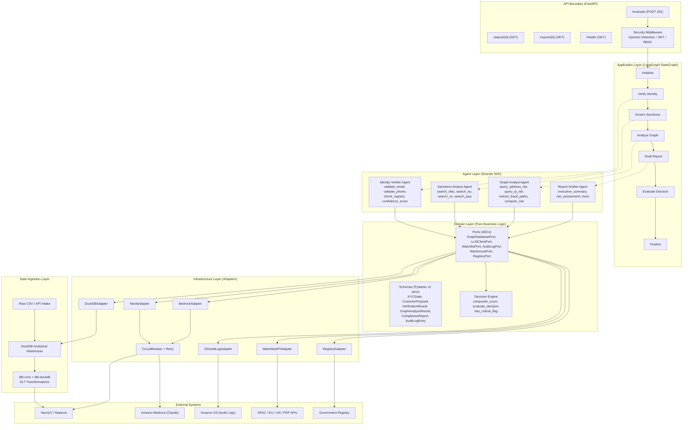
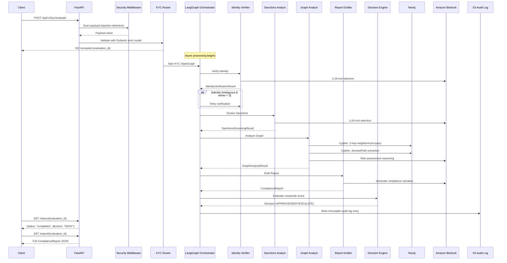
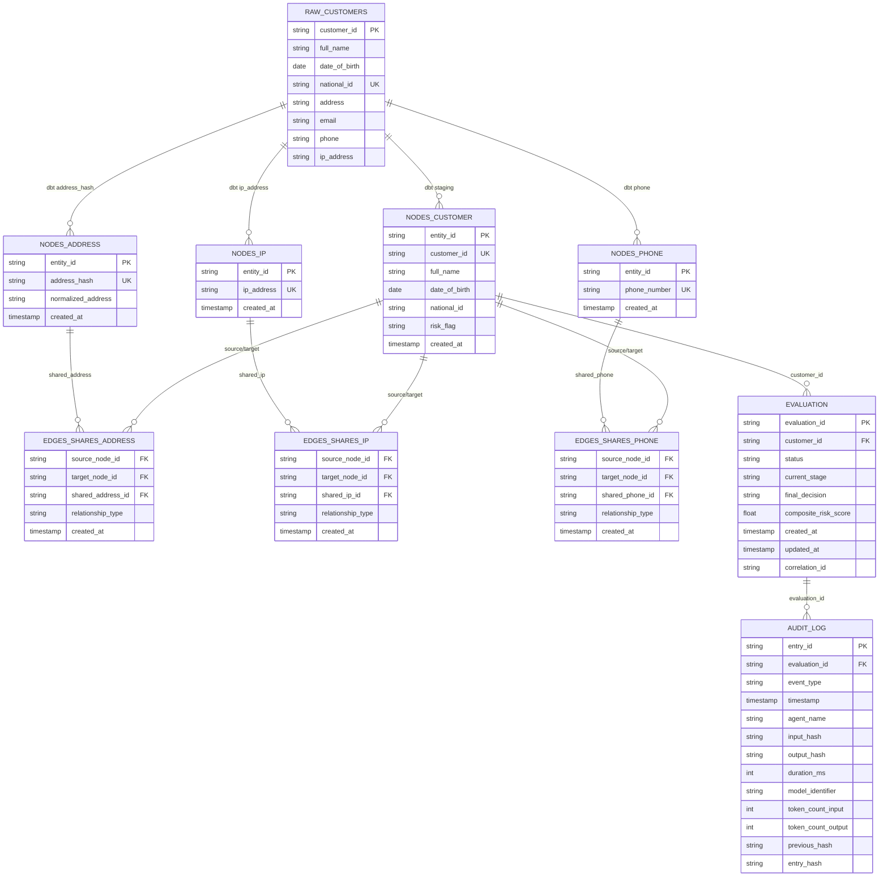
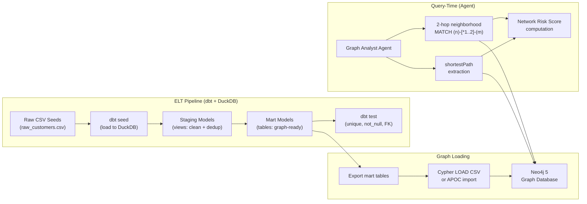
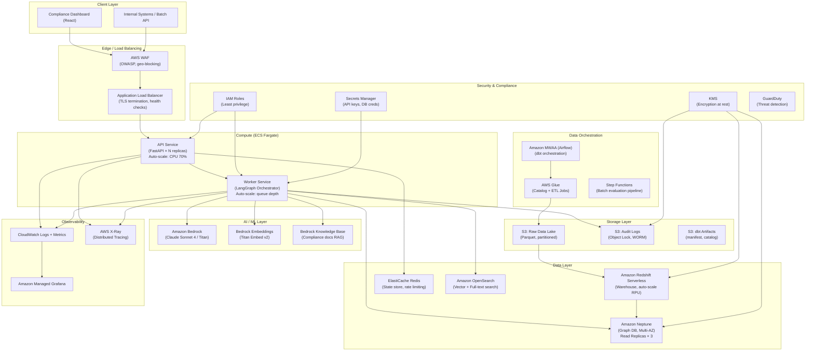

# Interview Preparation Guide: Autonomous Multi-Agent KYC Investigation & Fraud Network Pipeline

> **Role:** Senior AI Data Engineer (20+ Years Experience)
> **Project:** dbt-graphrag-kyc-agents
> **Core Objective:** Demonstrate deep expertise in traditional data stacks, enterprise backend architectures, and modern cloud-native AI/Data scaling.

---

## 1. Executive Summary & Core Project Architecture

### High-Level Technical Overview

This system is an **enterprise-grade KYC (Know Your Customer) fraud detection pipeline** that identifies synthetic identity fraud rings during customer onboarding. It combines:

- **Multi-Agent AI Orchestration** — 5 specialized agents coordinated by a LangGraph state machine
- **Graph-Based Relationship Analysis (GraphRAG)** — Neo4j 2-hop traversals to discover hidden fraud networks
- **Hexagonal Architecture (Ports & Adapters)** — Zero coupling between business logic and infrastructure
- **ELT Pipeline (dbt + DuckDB)** — Data transformation from raw CSV into graph-ready models
- **ISO 27001/42001 Compliance** — Immutable audit trails with hash chains, full LLM explainability

**Business Problem Solved:** Traditional KYC systems verify customers in isolation. A fraudster can pass every individual check while sharing infrastructure (addresses, IPs, phones) with blacklisted entities. This system queries multi-hop graph relationships to expose those hidden connections.

**Key Metrics:**
- 5 specialized AI agents working as a coordinated team
- 18 correctness properties verified via Hypothesis property-based testing
- 7 architectural boundary tests preventing hexagonal layer violations
- Decision determinism guaranteed — same inputs always produce same outputs
- Sub-120-second end-to-end evaluation latency target

### DIAGRAM 1: Comprehensive End-to-End Application Architecture



### Key Architectural Decisions to Articulate

| Decision | Rationale |
|----------|-----------|
| Hexagonal Architecture | Complete decoupling of business logic from I/O; adapters swappable for testing/cloud migration |
| LangGraph for Orchestration | Deterministic state machine with explicit conditional edges, retry semantics, and full traceability |
| Strands Agents SDK | @tool decorator pattern for LLM-driven tool selection; read-only constraint enforcement |
| Pydantic v2 strict mode | Runtime type safety at every boundary; zero implicit coercion; serialization round-trip guarantees |
| dbt for ELT | Version-controlled SQL transformations; built-in testing (unique, not_null, relationships); idempotent runs |
| Neo4j for Graph | Native graph traversal (Cypher); APOC extensions; 2-hop neighborhood queries in O(edges) |
| Circuit Breaker pattern | Prevents cascading failures; CLOSED→OPEN→HALF_OPEN state machine per external service |

---

## 2. Backend & API Design (Current Implementation)

### API Architecture: REST with Async Processing Pattern

The system uses a **REST API built on FastAPI** with an **asynchronous processing pattern** (Accept → Poll → Retrieve):

1. **POST /api/v1/kyc/evaluate** — Accepts customer payload, returns `202 Accepted` with `evaluation_id`
2. **GET /api/v1/kyc/status/{id}** — Polls current evaluation state (stage, decision)
3. **GET /api/v1/kyc/report/{id}** — Retrieves completed compliance report
4. **GET /api/v1/health** — Liveness/readiness check
5. **GET /metrics** — Prometheus metrics endpoint

**Why REST with 202 Accepted (not synchronous):**
- KYC evaluations involve 4 sequential agent invocations, each hitting external services
- End-to-end latency target is <120 seconds — far exceeds acceptable HTTP response times
- Polling pattern enables frontend progress indicators and graceful timeout handling
- Decouples acceptance validation from processing — immediate feedback to caller

### Authentication, Authorization & Security

| Layer | Implementation |
|-------|---------------|
| Authentication | JWT tokens (python-jose with cryptography backend) |
| Authorization | RBAC with evaluation-level access control |
| Input Validation | Pydantic v2 strict models with field-level validators (email RFC 5322, phone E.164, IP format) |
| Injection Prevention | Regex-based prompt injection scanner (10 known patterns); Cypher query whitelist |
| Rate Limiting | Configurable per-minute limits (default 100 req/min) |
| Payload Size | Max 1MB request body |
| CORS | Middleware-configured (restrictive in production) |
| Correlation Tracking | X-Correlation-Id header propagated through all layers |

### Security Middleware Deep Dive

The `SecurityMiddleware` scans all incoming payloads for:
- Prompt injection patterns: "ignore previous instructions", "[INST]", "<|system|>", etc.
- Unicode direction overrides and null byte attacks
- Control character injection
- Cypher write operations (CREATE, MERGE, SET, DELETE blocked; only MATCH...RETURN permitted)

**Key Interview Point:** "We enforce defense-in-depth. Even if an attacker bypasses API validation, the Cypher query whitelist at the adapter layer prevents graph mutation. Agents are read-only by design."

### Performance Optimization Techniques

| Technique | Implementation |
|-----------|---------------|
| Async I/O | FastAPI with uvicorn[standard]; async Neo4j driver; all port methods are `async` |
| Connection Pooling | Neo4j AsyncDriver manages connection pool internally |
| Circuit Breaker | Per-service CB prevents wasting time on downed services (5 failures → open → 60s recovery) |
| Retry with Backoff | Configurable max_retries=3 per agent invocation |
| State Machine Routing | Conditional edges short-circuit on critical flags (immediate DENY skips remaining agents) |
| Prometheus Metrics | Histograms for latency tracking; counters for throughput; gauges for active evaluations |
| Structured Logging | structlog with JSON output; context-bound correlation IDs |
| Token Budget | Per-evaluation token cap (50,000 tokens) prevents runaway LLM costs |

### DIAGRAM 2: API Design & Component Interaction Flow



---

## 3. Database Design & Relational Storage (Current Implementation)

### Schema Design Philosophy

The system uses a **graph-first data model** rather than traditional relational normalization. However, understanding how this maps to relational concepts is critical for interview discussions:

**Relational Equivalent (if implemented in SQL Server):**

| Entity | Table | Primary Key | Indexes |
|--------|-------|-------------|---------|
| Customer | `dim_customer` | `customer_id` (UUID) | `national_id` (unique), `email` (B-tree), `address_hash` (B-tree) |
| Address | `dim_address` | `address_hash` (MD5) | `normalized_address` (full-text) |
| IP Address | `dim_ip_address` | `ip_address` (varchar) | Composite: `(ip_address, first_seen_at)` |
| Phone Number | `dim_phone` | `phone_number` (E.164) | `phone_number` (unique) |
| Evaluation | `fact_evaluation` | `evaluation_id` (UUID) | `customer_id` (FK), `created_at` (B-tree desc) |
| Audit Log | `fact_audit_log` | `entry_id` (UUID) | `evaluation_id` (FK), `timestamp` (clustered desc) |
| Watchlist Match | `bridge_watchlist_match` | `match_id` (UUID) | `customer_id`, `similarity_score` (desc) |

### ELT Pipeline: dbt + DuckDB → Neo4j

**Why dbt over traditional ETL (SSIS)?**

| Aspect | SSIS (Traditional) | dbt (Modern) |
|--------|-------------------|--------------|
| Transformation Logic | GUI + C# scripts in packages | SQL + Jinja2 in version-controlled files |
| Testing | Manual validation scripts | Built-in: unique, not_null, relationships, custom |
| Versioning | Binary .dtsx packages | Git-native SQL files |
| Dependency Management | Package references | `ref()` macro with DAG resolution |
| Idempotence | Requires careful design | Materialization strategies (view, table, incremental) |
| Environment Parity | Dev/Prod drift common | Profiles.yml per environment |

### dbt Model Layers

**Staging Layer** (`models/staging/`) — Materialized as views:
```sql
-- stg_customers.sql: Clean, deduplicate, normalize
SELECT DISTINCT
    customer_id,
    TRIM(full_name) AS full_name,
    date_of_birth,
    national_id,
    TRIM(address) AS address,
    LOWER(TRIM(email)) AS email,
    phone,
    ip_address,
    md5(LOWER(TRIM(address))) AS address_hash,  -- Deterministic dedup key
    CURRENT_TIMESTAMP AS loaded_at
FROM {{ source('raw', 'customers') }}
WHERE customer_id IS NOT NULL AND full_name IS NOT NULL
```

**Marts Layer** (`models/marts/`) — Materialized as tables, graph-ready:
- `nodes_customer` — Customer entity nodes
- `nodes_address` — Address entity nodes (keyed by MD5 hash)
- `nodes_ip` — IP address entity nodes
- `nodes_phone` — Phone number entity nodes
- `edges_shares_address` — Customer↔Customer via shared address
- `edges_shares_ip` — Customer↔Customer via shared IP
- `edges_shares_phone` — Customer↔Customer via shared phone

**Graph Edge Construction Pattern:**
```sql
-- edges_shares_address.sql: Self-join on shared infrastructure
SELECT
    a.customer_id AS source_node_id,
    b.customer_id AS target_node_id,
    a.address_hash AS shared_address_id,
    'SHARES_ADDRESS' AS relationship_type
FROM {{ ref('stg_customers') }} a
INNER JOIN {{ ref('stg_customers') }} b
    ON a.address_hash = b.address_hash
    AND a.customer_id < b.customer_id  -- Prevent duplicate/self edges
```

### Data Warehousing Strategy (Traditional Context)

If discussing migration from a **Microsoft SQL Server Ecosystem**:

| Component | Traditional Stack | This Project's Equivalent |
|-----------|------------------|---------------------------|
| OLTP Store | SQL Server (normalized 3NF) | Not applicable (event-driven) |
| Integration | SSIS packages (.dtsx) | dbt models with `ref()` DAG |
| Warehouse | SQL Server (star schema) | DuckDB (columnar, in-process) |
| Reporting | SSRS (.rdl reports) | Prometheus + Grafana dashboards |
| Cubes | SSAS (MOLAP/Tabular) | Not applicable (real-time scoring) |
| Scheduling | SQL Server Agent | dbt Cloud / Airflow / ECS scheduled tasks |

### DIAGRAM 3: Database Schema / ERD & Warehousing Architecture





---

## 4. Enterprise Scale-Out & Modern Cloud Transformation (AWS & Modern Stack)

### Re-Architecture for Petabyte Scale & Real-Time AI Workloads

The current system is designed for single-instance deployment handling ~100 evaluations/minute. To scale to **petabyte-scale data** with **real-time AI workloads**, we re-architect using AWS managed services.

### 4.1 Cloud Platform (AWS) — Re-Platforming Strategy

| Current Component | AWS Production Equivalent | Scaling Characteristics |
|------------------|---------------------------|------------------------|
| Local DuckDB | **Amazon Redshift Serverless** | Petabyte-scale columnar warehouse; auto-scaling RPU |
| Neo4j Docker | **Amazon Neptune** (or Neo4j Aura) | Managed graph DB; read replicas; multi-AZ |
| FastAPI on localhost | **AWS ECS Fargate** behind ALB | Auto-scaling (CPU 70% target); no instance management |
| In-memory state | **Amazon ElastiCache (Redis)** | Evaluation state store; sub-ms latency |
| S3 audit logs | **Amazon S3 + S3 Object Lock** | WORM compliance; lifecycle policies; cross-region replication |
| Local file CSV | **Amazon S3 + AWS Glue** | Data lake ingestion; schema registry; partitioning |
| Prometheus metrics | **Amazon CloudWatch + X-Ray** | Native integration; distributed tracing; alarm automation |
| Bedrock (same) | **Amazon Bedrock** | Managed LLM inference; provisioned throughput for predictable latency |

### 4.2 Data Transformation & Modeling: dbt at Scale

**dbt Cloud (Enterprise) or dbt-core on ECS:**

- **Incremental Materializations**: For streaming customer data, use `incremental` strategy with `unique_key` to avoid full-table rebuilds
- **Snapshots (SCD Type 2)**: Track customer attribute changes over time (address changes trigger new edge evaluation)
- **Freshness Checks**: `source_freshness` ensures upstream data is within SLA
- **Slim CI**: Only run modified models + downstream dependents on PRs
- **dbt Mesh**: For multi-team ownership, publish marts as cross-project references

```yaml
# Incremental model for high-volume streaming
{{ config(materialized='incremental', unique_key='customer_id') }}
SELECT * FROM {{ source('streaming', 'onboarding_events') }}

WHERE event_timestamp > (SELECT MAX(event_timestamp) FROM {{ this }})

```

### 4.3 Graph Database Layer: Neo4j / Amazon Neptune at Scale

**Amazon Neptune Considerations:**

| Feature | Neo4j (Current) | Amazon Neptune (Production) |
|---------|-----------------|----------------------------|
| Query Language | Cypher | Gremlin (TinkerPop) or openCypher |
| Scaling | Vertical (single instance) | Read replicas (up to 15); storage auto-scales to 128TB |
| HA | Manual clustering | Multi-AZ with automatic failover |
| Bulk Load | Cypher LOAD CSV, APOC | Neptune Bulk Loader from S3 (CSV/JSON) |
| ACID | Full ACID | Full ACID per-request |
| Index | Schema indexes, full-text | Auto-indexed; SPARQL/Gremlin optimized |

**Graph Data Modeling for Fraud Networks:**

```
(:Customer {customer_id, full_name, risk_flag})
    -[:REGISTERED_AT]->(:Address {address_hash, normalized})
    -[:CONNECTED_FROM]->(:IPAddress {ip, geo_location})
    -[:USES_PHONE]->(:PhoneNumber {e164_number})
    -[:SHARES_ADDRESS]->(:Customer)  // Derived edge
    -[:SHARES_IP]->(:Customer)       // Derived edge
    -[:FLAGGED_ON]->(:WatchlistEntity {source, severity})
```

**Key Cypher Patterns (Interview-Ready):**

```cypher
-- 2-hop neighborhood from customer's address
MATCH (c:Customer {customer_id: $customer_id})-[:REGISTERED_AT]->(a:Address)
      -[*1..2]-(neighbor)
WHERE neighbor:WatchlistEntity OR neighbor.risk_flag = 'HIGH'
RETURN neighbor, length(shortestPath((c)-[*]-(neighbor))) AS distance

-- Fraud ring detection (connected component)
MATCH (c:Customer)-[:SHARES_ADDRESS|SHARES_IP|SHARES_PHONE*1..3]-(ring_member)
WHERE ring_member.risk_flag IN ['HIGH', 'SANCTIONED']
WITH c, collect(DISTINCT ring_member) AS ring_members
WHERE size(ring_members) >= 2
RETURN c.customer_id, ring_members
```

### 4.4 Vector Infrastructure: Embeddings & RAG Patterns

**Use Cases for Vector Store in KYC:**

1. **Semantic Name Matching**: Embed customer names using sentence transformers; fuzzy match against watchlists with cosine similarity (handles transliterations, aliases, spelling variants)
2. **Document Embedding**: Embed onboarding documents (ID scans, utility bills) for similarity search against known fraudulent documents
3. **RAG for Report Generation**: Retrieve relevant compliance precedents and regulatory guidance for report drafting agent
4. **Anomaly Detection**: Embed behavioral patterns; flag outliers in vector space

**Technology Options:**

| Vector Store | Strengths | Use Case Fit |
|-------------|-----------|--------------|
| **pgvector** (Aurora) | Integrated with existing RDS; HNSW/IVFFlat indexes | Name matching alongside relational metadata |
| **Amazon OpenSearch** (k-NN) | Managed; combines full-text + vector search | Watchlist search with hybrid scoring |
| **Pinecone** | Purpose-built; serverless; metadata filtering | High-volume real-time name screening |
| **Amazon Bedrock Knowledge Bases** | Managed RAG; auto-chunking; S3 source sync | Compliance document retrieval for report drafter |

**Architecture Pattern: Hybrid GraphRAG + VectorRAG**

```
Customer Name → Embedding Model (Titan/Cohere) → Vector Search (top-K watchlist matches)
                                                         ↓
                                              Candidate Entities
                                                         ↓
Customer → Graph Traversal (Neo4j 2-hop) → Structural Relationships
                                                         ↓
                                              Combined Risk Signal
                                                         ↓
                                         LLM Reasoning (Bedrock Claude)
                                                         ↓
                                            Explainable Risk Assessment
```

### 4.5 Python Backend Ecosystem: Key Libraries

| Library | Role in Production System |
|---------|--------------------------|
| **FastAPI** | Async HTTP layer; automatic OpenAPI docs; dependency injection |
| **Pydantic v2** | Data validation at every boundary; 5-50x faster than v1 (Rust core) |
| **pydantic-settings** | 12-factor app config from env vars with type safety |
| **LangGraph** | Deterministic agent orchestration; checkpointing; human-in-the-loop |
| **Strands Agents SDK** | Tool-use agents with @tool decorator; model-agnostic |
| **httpx** | Async HTTP client for external APIs (replaces requests) |
| **boto3** | AWS SDK for Bedrock, S3, Neptune interactions |
| **neo4j** (driver) | Official async Neo4j Python driver with connection pooling |
| **duckdb** | In-process OLAP engine; Pandas integration; zero-copy Arrow |
| **structlog** | Structured JSON logging with context binding (correlation IDs) |
| **prometheus-client** | Metrics exposition for Grafana dashboards |
| **python-jose** | JWT token creation/validation with cryptography backend |
| **Hypothesis** | Property-based testing; finds edge cases humans miss |
| **pytest-archon** | Architecture boundary enforcement via import analysis |

**For PySpark at Scale (Data Lake Processing):**

```python
# If migrating DuckDB warehouse to Spark for petabyte scale
from pyspark.sql import SparkSession
from pyspark.sql.functions import md5, lower, trim, col

spark = SparkSession.builder.appName("kyc-elt").getOrCreate()

# Equivalent of stg_customers dbt model at scale
customers = (
    spark.read.parquet("s3://kyc-data-lake/raw/customers/")
    .dropDuplicates(["customer_id"])
    .withColumn("address_hash", md5(lower(trim(col("address")))))
    .withColumn("email", lower(trim(col("email"))))
)

# Equivalent of edges_shares_address (self-join on shared infra)
edges = (
    customers.alias("a")
    .join(customers.alias("b"), "address_hash")
    .filter(col("a.customer_id") < col("b.customer_id"))
    .select(
        col("a.customer_id").alias("source_node_id"),
        col("b.customer_id").alias("target_node_id"),
        col("a.address_hash").alias("shared_address_id"),
    )
)
```

### Complete AWS Production Architecture Diagram



---

## 5. Advanced Interview Scenarios & Edge Cases (Q&A Appendix)

### Category A: Architecture & Design Patterns

**Q: Why Hexagonal Architecture over Clean Architecture or traditional layered?**

A: Hexagonal (Ports & Adapters) gives us the strongest isolation guarantees for a system where infrastructure components change frequently. We swap between Neo4j (dev) and Neptune (prod), between Bedrock and OpenAI-compatible endpoints, between DuckDB (dev) and Redshift (prod). The port interfaces remain stable while adapters are swapped via dependency injection. Clean Architecture is conceptually similar but Hexagonal's explicit port/adapter vocabulary makes boundary enforcement testable — we have 7 architecture tests using pytest-archon that verify import boundaries on every PR.

**Q: How do you ensure Decision Determinism?**

A: Three mechanisms:
1. All LLM calls use `temperature=0.0` — eliminates sampling randomness
2. The composite risk score is a pure mathematical function with no side effects
3. The decision engine uses deterministic threshold comparison (no random tiebreakers)
4. Property-based tests (Hypothesis) verify: `∀ inputs: evaluate_decision(inputs) == evaluate_decision(inputs)` across 1000+ examples

**Q: How does the state machine handle partial failures?**

A: LangGraph conditional edges implement per-stage retry logic:
- Identity verification: up to 3 retries on "ambiguous" status
- Sanctions screening: up to 3 retries on "screening_ambiguous"
- If retries exhausted → route to "escalate" → human review
- If any agent raises `AgentTimeoutError` → circuit breaker records failure → escalate
- The `KYCState` object carries `retry_count_identity` and `retry_count_sanctions` as bounded integers (0-3)

**Q: Explain the audit trail hash chain (ISO 27001).**

A: Each `AuditLogEntry` contains:
- `previous_hash`: SHA-256 of the preceding entry (or "GENESIS" for first)
- `entry_hash`: SHA-256 of (evaluation_id + event_type + timestamp + input_hash + output_hash + previous_hash)
- Written to S3 with Object Lock (WORM) — physically immutable
- Any tampering breaks the chain: `hash(entry[n]) != entry[n+1].previous_hash`
- Compliance auditors can verify the entire chain mathematically

---

### Category B: Data Engineering & Pipeline Design

**Q: How do you handle schema evolution in the dbt pipeline?**

A: Multiple strategies:
1. **Backward-compatible changes** (new columns): Add with `DEFAULT NULL`, no breaking changes downstream
2. **Breaking changes** (renamed/removed columns): Version the model (`v2_nodes_customer`), deprecate old with `deprecation_date` in schema.yml
3. **dbt snapshots**: SCD Type 2 for slowly changing dimensions (customer address history)
4. **Contract enforcement**: dbt contracts (v1.5+) with `columns.data_type` and `constraints` prevent schema drift
5. **CI check**: `dbt build --select state:modified+` in PRs ensures no downstream breakage

**Q: DuckDB vs. Redshift vs. BigQuery — why DuckDB for dev?**

A: DuckDB provides:
- Zero-infrastructure local development (single file or in-memory)
- Full SQL compatibility with analytical workloads (columnar, vectorized)
- dbt-duckdb adapter gives identical SQL semantics to production warehouse
- Sub-second query times for development datasets (<1M rows)
- No cloud cost during development iteration

For production (>1B rows), Redshift Serverless provides:
- Automatic scaling (RPU-based, scales to zero)
- Concurrency scaling for burst workloads
- Federated queries to S3 data lake (Spectrum)
- Native ML inference with Bedrock integration

**Q: How do you ensure ELT idempotence?**

A: Three guarantees:
1. **Staging views** use `SELECT DISTINCT` with deterministic dedup keys (`customer_id`)
2. **Mart tables** use full-refresh materialization (default) — `DROP TABLE IF EXISTS; CREATE TABLE AS SELECT`
3. **Address hashes** use `md5(LOWER(TRIM(address)))` — same input always produces same hash
4. Property test verifies: `∀ raw_data: dbt_run(raw_data) == dbt_run(raw_data)` (Hypothesis)

**Q: How would you handle real-time streaming vs. batch?**

A: Current system is batch-triggered (API call → evaluate). For real-time:
1. **Amazon Kinesis Data Streams** for ingestion (customer onboarding events)
2. **Kinesis Data Firehose** → S3 (micro-batches every 60s)
3. **dbt incremental models** process only new records (`WHERE event_ts > max(this.event_ts)`)
4. **Neptune Streams** for change data capture on graph mutations
5. **EventBridge** triggers re-evaluation when graph topology changes (new edge = new risk)

---

### Category C: AI/ML Infrastructure & LLM Operations

**Q: How do you prevent prompt injection in a multi-agent system?**

A: Defense-in-depth with 4 layers:
1. **API layer**: Regex scanner checks 10+ known injection patterns before payload reaches agents
2. **Input sanitization**: Remove control characters, null bytes, Unicode direction overrides
3. **Agent constraints**: Strands agents have tool-level restrictions (read-only Cypher whitelist)
4. **Output validation**: All agent responses must validate against Pydantic strict schemas — malformed LLM output is rejected, not propagated

Security tests verify all patterns are caught (adversarial test suite runs on every PR).

**Q: Explain the token budget mechanism.**

A: `AppConfig.token_budget_per_evaluation = 50,000 tokens`. Enforced by:
1. `LLMInvocationMetadata` tracks `token_count_input + token_count_output` per call
2. Orchestrator accumulates token usage across all agents in `KYCState`
3. If cumulative usage exceeds budget → `TokenBudgetExceededError` → evaluation escalated
4. Prevents runaway costs from LLM loops or adversarial inputs
5. Prometheus counter `kyc_token_usage_total` enables cost dashboards

**Q: How do you handle LLM model versioning and reproducibility?**

A: ISO 42001 compliance requires full traceability:
1. Every LLM call records `ExplainabilitySchema`:
   - `prompt_template_hash` (SHA-256 of the template)
   - `model_identifier` + `model_version`
   - `temperature_setting` (always 0.0 for determinism)
   - `token_count_input/output`
   - `trace_mapping` (which source data nodes influenced the prompt)
2. Audit log stores input/output hashes — can verify exact reproduction
3. Model version pinned in `AppConfig` — changes require explicit PR + review

**Q: What happens if Bedrock is down? How do you handle LLM provider failover?**

A: Circuit breaker pattern with fallback:
1. `BedrockAdapter` circuit breaker: 5 consecutive failures → OPEN (reject all calls for 60s)
2. On OPEN → orchestrator routes to `OpenAIAdapter` (fallback provider)
3. HALF_OPEN after 60s → single test call → success = CLOSED, failure = re-OPEN
4. If ALL providers down → `LLMConnectionError` → evaluation ESCALATE_TO_HUMAN_REVIEW
5. Metric: `kyc_circuit_breaker_state` gauge alerts ops team instantly

---

### Category D: Scale, High Availability & Failure Modes

**Q: How does the system handle 10,000 concurrent evaluations?**

A: Horizontal scaling strategy:
1. **ECS Fargate auto-scaling**: Scale API service replicas based on ALB request count
2. **Worker service**: Scale based on SQS queue depth (evaluations queued)
3. **Neptune read replicas** (×3): Distribute graph queries across replicas
4. **Redis**: Evaluation state stored in Redis (not in-memory) for shared access
5. **Rate limiting**: 100 req/min per client; burst allowance via token bucket
6. **Backpressure**: If queue depth > threshold, API returns 429 (Too Many Requests)

**Q: What's your disaster recovery strategy?**

A: RTO < 15 minutes, RPO < 1 minute:
1. **Neptune**: Multi-AZ with automatic failover (data replicated synchronously)
2. **S3 audit logs**: Cross-region replication (us-east-1 → eu-west-1)
3. **Redshift**: Automatic snapshots every 8 hours; cross-region copy
4. **ECS**: Multi-AZ task placement; unhealthy containers auto-replaced
5. **Infrastructure as Code**: Full Terraform state — rebuild from scratch in <30 minutes

**Q: How do you handle data drift and model degradation?**

A: Continuous monitoring:
1. **Feature drift**: Monitor distribution of identity_confidence, sanctions_score, network_risk over time (CloudWatch custom metrics)
2. **Decision distribution**: Alert if DENY rate changes >2σ from rolling 7-day mean
3. **Latency drift**: Histogram `kyc_evaluation_duration_seconds` — alert on p99 > 90s
4. **Schema drift**: dbt `source_freshness` + dbt contracts detect upstream changes
5. **Retraining signal**: If ESCALATE rate exceeds 15% → review thresholds and retrain embedding models

**Q: How would you handle a data breach or compromised graph database?**

A: Incident response:
1. **Detection**: GuardDuty alerts on unusual Neptune access patterns
2. **Containment**: IAM policy update to revoke compromised credentials (< 5 min)
3. **Assessment**: S3 audit log chain verification — identify which evaluations were affected
4. **Recovery**: Neptune point-in-time restore to pre-breach state
5. **Notification**: Regulatory reporting within 72 hours (GDPR) using audit trail evidence
6. **Prevention**: Rotate all credentials; review least-privilege policies; add Neptune VPC endpoint

---

### Category E: Curveball Questions & Architectural Pivots

**Q: "What if we need to support real-time graph updates as new customers onboard?"**

A: Neptune Streams + EventBridge:
1. Enable Neptune Streams (change data capture on graph mutations)
2. Lambda function triggered on new edge creation
3. If new edge connects to flagged entity → trigger re-evaluation of affected customers
4. Challenge: preventing evaluation storms (one new node could trigger 100s of re-evaluations)
5. Solution: Debounce with SQS FIFO (group by customer_id, 5-minute deduplication window)

**Q: "How would you add explainable AI for regulators who don't trust black-box LLMs?"**

A: Already built in (ISO 42001):
1. Every LLM assertion maps back to source data nodes via `trace_mapping`
2. Compliance report contains `source_references` per section
3. The Graph Analyst's risk score is mathematically derived (not LLM-generated):
   - `network_risk = avg_hop_risk × 0.4 + max_severity × 0.4 + path_count_factor × 0.2`
4. LLMs are used for narrative generation, not decision-making. The decision engine is pure deterministic code.
5. "Show me why": Given evaluation_id → retrieve all paths from Neo4j → visualize graph → show which shared infrastructure triggered DENY

**Q: "What if the graph has 1 billion nodes? How does 2-hop traversal scale?"**

A: Graph query optimization:
1. **Index everything**: Entity_id, label-specific property indexes
2. **Bounded traversal**: `[*1..2]` limits explosion; never allow open-ended traversal
3. **Result limiting**: `LIMIT 100` on neighbor queries; prioritize flagged entities
4. **Graph partitioning** (Neptune): Partition by geographic region or time window
5. **Materialized views**: Pre-compute "customers within 2 hops of flagged entities" as a background job; store in a `high_risk_proximity` table
6. **Alternative**: For >100M nodes, consider Apache TinkerPop with SparkGraphComputer for batch 2-hop computation, serve results via Redis

**Q: "Why not use LangChain instead of Strands + LangGraph?"**

A: Separation of concerns:
1. **LangGraph** handles orchestration (state machine, conditional routing, retries) — it's deterministic infrastructure
2. **Strands SDK** handles tool-use agents (LLM decides which tools to call) — it's the agentic reasoning layer
3. LangChain conflates both into one framework, creating tight coupling
4. Strands @tool pattern is simpler, testable in isolation, and model-agnostic
5. LangGraph's StateGraph gives us checkpoint/resume, human-in-the-loop, and visualization for free

**Q: "How do you test a system that depends on LLMs (non-deterministic by nature)?"**

A: Multi-strategy testing approach:
1. **Unit tests**: Mock LLM ports; verify business logic independently (pure functions)
2. **Contract tests**: Verify agent outputs conform to Pydantic schemas regardless of content
3. **Property tests**: `temperature=0.0` makes outputs deterministic for same inputs
4. **Snapshot tests**: Golden-file responses for known inputs; alert on drift
5. **Integration tests**: Real LLM calls in CI (nightly, not per-PR) with budget caps
6. **Architecture tests**: Verify agents only call allowed ports (never infrastructure directly)

**Q: "Walk me through a fraud ring detection scenario end-to-end."**

A: Complete walkthrough:

1. **Ingestion**: Customer "Alice" submits onboarding via POST /evaluate
   - Address: "123 Main St, Apt 4, New York"
   - IP: 192.168.1.100, Phone: +14155551234

2. **dbt Transform**: Address hashed to `md5("123 main st, apt 4, new york")` → `a7f3...`

3. **Graph State**: Neo4j already contains:
   - Bob (flagged: SANCTIONS_HIT) registered at same address hash `a7f3...`
   - Charlie (flagged: FRAUD_RING) connected from same IP 192.168.1.100

4. **Identity Verifier**: Alice's documents validate → confidence 0.92 (HIGH)

5. **Sanctions Analyst**: No direct name match → match_score 0.05 (CLEAR)

6. **Graph Analyst**:
   - `query_address_neighborhood("a7f3...")` → finds Bob (2 hops: Alice→Address→Bob)
   - `query_ip_neighborhood("192.168.1.100")` → finds Charlie (2 hops: Alice→IP→Charlie)
   - `extract_fraud_paths(alice_id, [bob_id, charlie_id])` → 2 paths
   - `compute_network_risk_score(paths, ["HIGH", "HIGH"])` → 0.82 (HIGH)

7. **Decision Engine**:
   - `has_critical_flag`: `graph_analysis_result.has_confirmed_fraud_ring = True` → **IMMEDIATE DENY**
   - (Even without critical flag: composite = (1-0.92)×0.3 + 0.05×0.4 + 0.82×0.3 = 0.024 + 0.02 + 0.246 = 0.29 → would be APPROVE, but critical flag overrides)

8. **Report Drafter**: Generates narrative: "Customer linked to sanctioned entity Bob via shared address and fraud ring member Charlie via shared IP address."

9. **Audit**: Hash-chained log entries written to S3 with Object Lock

---

### Category F: Cost Optimization & Operational Excellence

**Q: "What's the estimated cost per evaluation?"**

A: Cost breakdown per evaluation:
- Bedrock Claude Sonnet (4 agent calls × ~2000 tokens each): ~$0.08
- Neptune query (4 Cypher queries): ~$0.001
- S3 audit writes (5-10 entries × 2KB each): ~$0.0001
- ECS Fargate compute (~30s at 0.5 vCPU): ~$0.002
- **Total: ~$0.08-0.12 per evaluation** (LLM cost dominates)

Optimization levers:
1. **Caching**: Cache identical sanctions screening results (Redis, 24h TTL)
2. **Prompt compression**: Minimize context window size
3. **Model selection**: Use Haiku for simple validations, Sonnet for complex reasoning
4. **Batch inference**: Group evaluations for bulk Bedrock calls (Batch API)
5. **Early termination**: Critical flag → DENY skips report drafting (saves 1 LLM call)

**Q: "How do you handle regulatory requirements across jurisdictions?"**

A: Configurable by environment:
1. **Watchlist sources**: Configurable list (`["ofac_sdn", "eu_sanctions", "un_sanctions", "pep"]`)
2. **Decision thresholds**: Per-jurisdiction config (stricter thresholds for high-risk jurisdictions)
3. **Data residency**: Cross-region S3 replication policies; Neptune cluster per region
4. **Audit retention**: Configurable per regulation (7 years for AML, GDPR data minimization)
5. **Report templates**: Region-specific compliance narratives (FCA, FinCEN, AUSTRAC)

---

*End of Interview Preparation Guide*
