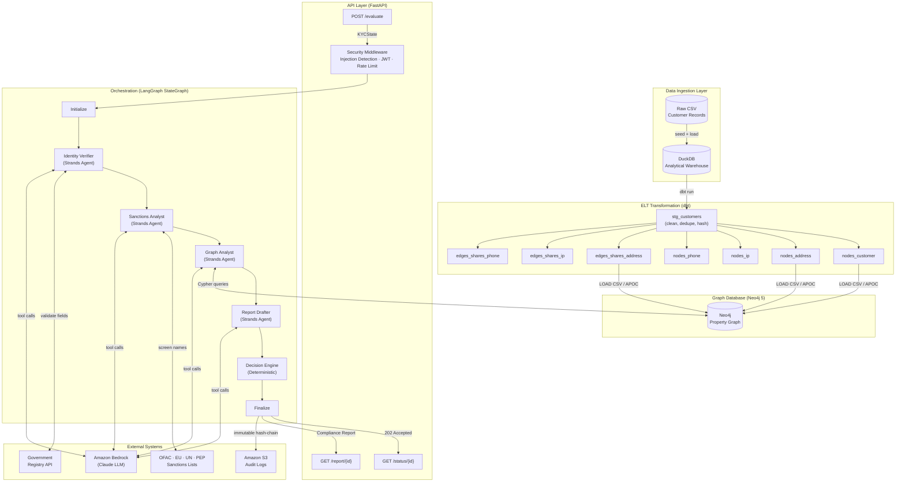
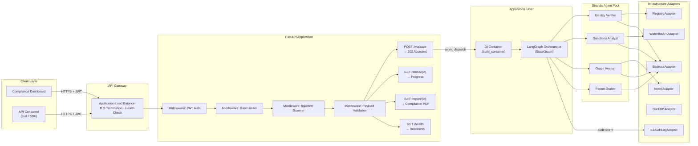
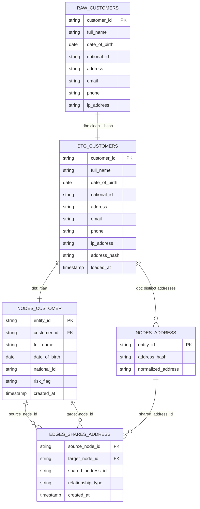
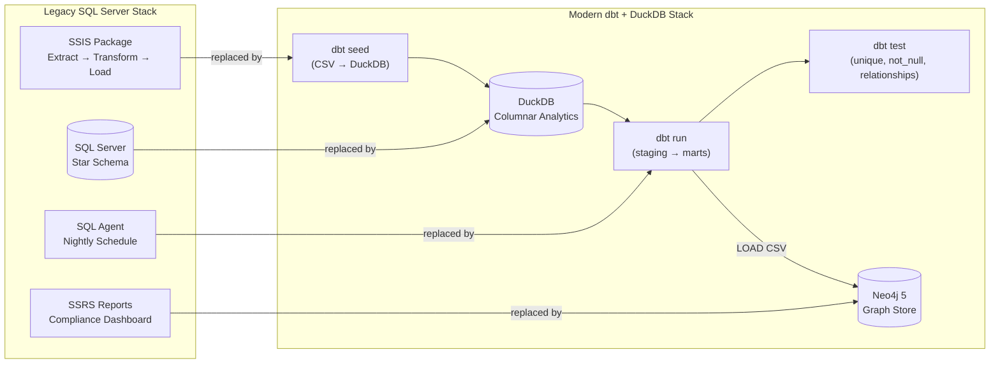
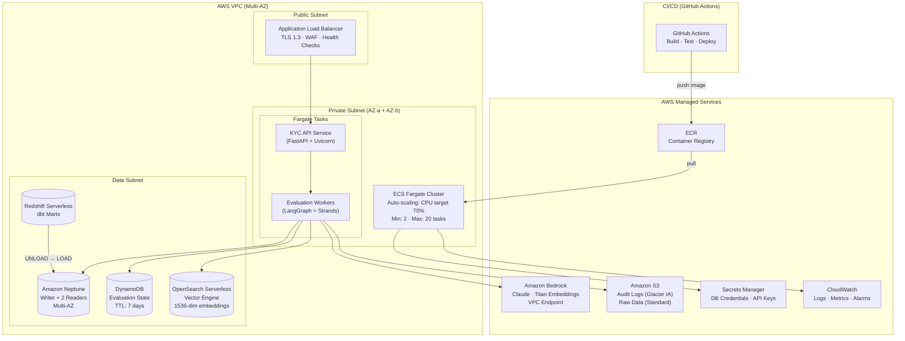

# Interview Preparation: Autonomous Multi-Agent KYC Investigation & Fraud Network Pipeline

> **Prepared for:** Principal Data Architect / Senior AI Data Engineer Interview
> **Project:** dbt-graphrag-kyc-agents
> **Architecture:** Hexagonal (Ports & Adapters) + Domain-Driven Design + Multi-Agent Orchestration
> **Stack:** Python 3.11 · LangGraph · Strands Agents SDK · Neo4j · DuckDB · dbt · FastAPI · AWS

---

## 1. Executive Summary & Core Project Architecture

### 1.1 Business Problem

Financial institutions face a critical blind spot in KYC (Know Your Customer) onboarding: **Synthetic Identity Fraud Rings**. Traditional KYC systems operate in isolation—verifying documents, screening names against watchlists—but fail to detect clusters of fabricated identities that share hidden infrastructure (addresses, IP addresses, phone numbers) with known fraudulent entities.

**The gap:** A fraudster passes every individual check. But one graph traversal away, they share an address with a sanctioned entity that nobody is querying.

### 1.2 System Objective

Build an enterprise-grade, autonomous evaluation pipeline that:

1. Accepts customer onboarding requests via async REST API
2. Orchestrates 5 specialized AI agents through a deterministic LangGraph state machine
3. Discovers multi-hop relationships via GraphRAG (Graph-Retrieval Augmented Generation)
4. Produces explainable compliance reports with immutable audit trails (ISO 27001/42001)
5. Issues decisions (APPROVE / DENY / ESCALATE_TO_HUMAN_REVIEW) within 120 seconds

### 1.3 Key Technical Differentiators

| Differentiator | Implementation |
|---|---|
| Deterministic orchestration | LangGraph StateGraph with typed KYCState aggregate root |
| Graph-based fraud detection | Neo4j 2-hop neighborhood traversal via parameterized Cypher |
| Hexagonal architecture | Domain layer imports only stdlib + Pydantic; enforced by pytest-archon |
| Property-based testing | Hypothesis library validates 18 invariants (score bounds, determinism, round-trip) |
| Explainable AI | Every LLM call traced with prompt hash, token count, and source node mapping |
| Security-first | Prompt injection detection, Cypher whitelist, input sanitization middleware |

### 1.4 DIAGRAM 1: End-to-End Data & Application Flow



### 1.5 Architecture Layers (Hexagonal / Clean Architecture)

| Layer | Responsibility | Import Rules |
|-------|---------------|--------------|
| **Domain** (`src/domain/`) | Pure business logic, schemas, ports (ABCs), decision engine | stdlib + Pydantic ONLY |
| **Infrastructure** (`src/infrastructure/`) | Adapters implementing ports (Neo4j, Bedrock, S3, DuckDB) | May import domain |
| **Application** (`src/application/`) | LangGraph orchestrator, DI container wiring | May import domain |
| **API** (`src/api/`) | FastAPI routes, security middleware, HTTP boundary | May import domain + application |
| **Agents** (`src/agents/`) | Strands agent definitions with @tool decorators | May import domain (ports, schemas) |

**Enforcement:** `pytest-archon` runs on every PR, failing the build if any layer violation is introduced.

---

## 2. Backend & API Design (Current Implementation)

### 2.1 API Pattern Selection: Asynchronous REST with Polling

**Rationale:** KYC evaluations involve multiple sequential LLM calls and graph traversals (60–120s total). A synchronous request/response pattern would exhaust connection pools and trigger gateway timeouts. Instead:

- `POST /api/v1/kyc/evaluate` → **202 Accepted** (immediate, non-blocking)
- `GET /api/v1/kyc/status/{id}` → Poll evaluation progress
- `GET /api/v1/kyc/report/{id}` → Retrieve completed compliance report
- `GET /api/v1/health` → Liveness + readiness probe

**Why not GraphQL?** The KYC domain has a fixed, well-defined response shape. GraphQL's flexibility adds complexity without benefit here. The report structure is standardized for regulatory compliance — clients should not select arbitrary subsets.

**Why not gRPC?** Internal microservice communication could use gRPC, but the primary consumer is a compliance dashboard (browser-based). REST with OpenAPI spec provides better DX for integration teams.

### 2.2 Security Architecture

| Layer | Mechanism | Implementation |
|-------|-----------|----------------|
| Authentication | JWT (python-jose) | Bearer token validation on all `/kyc/*` routes |
| Authorization | RBAC via token claims | `compliance_officer`, `admin`, `auditor` roles |
| Input Validation | Pydantic v2 strict mode | Email (RFC 5322), Phone (E.164), IP (IPv4/v6) |
| Injection Defense | Regex pattern scanning | 10+ prompt injection patterns detected pre-LLM |
| Cypher Safety | Query whitelist + blocked ops | Only MATCH/RETURN allowed; CREATE/DELETE blocked |
| Sanitization | Unicode + control char stripping | Null bytes, direction overrides, control chars removed |
| Rate Limiting | Token bucket (100 req/min default) | Configurable via `KYC_RATE_LIMIT_PER_MINUTE` |
| Payload Size | 1MB max | Prevents resource exhaustion |

### 2.3 Connection Pooling & Resilience

```python
# Circuit breaker pattern (src/infrastructure/resilience/)
- Neo4j driver: connection pool managed by official neo4j-python driver (bolt pool)
- HTTP clients (httpx): async connection pooling with configurable limits
- Circuit breaker: opens after 5 consecutive failures, recovers after 60s
- Retry policy: exponential backoff, max 3 retries per agent invocation
- Timeout cascade: identity(10s) → sanctions(15s) → graph(20s) → report(30s)
```

### 2.4 Caching Strategy

| Cache Layer | Target | TTL | Invalidation |
|-------------|--------|-----|--------------|
| Sanctions list cache | OFAC/EU/UN snapshot | 24h | Daily refresh or webhook |
| Graph neighborhood cache | 2-hop results for hot addresses | 15min | Write-through on new edges |
| LLM response cache | Deterministic tool calls | Session-scoped | Per-evaluation lifecycle |

### 2.5 DIAGRAM 2: API Design & Component Interaction



---

## 3. Database Design & Relational Storage (Current Implementation)

### 3.1 Hybrid Storage Architecture

This system uses a **polyglot persistence** model rather than a single relational database:

| Store | Engine | Purpose | Access Pattern |
|-------|--------|---------|----------------|
| Analytical warehouse | DuckDB | ELT staging, dbt transformations, seed data | Columnar scans, batch transforms |
| Graph database | Neo4j 5 | Fraud network traversal, 2-hop queries | Cypher path queries, APOC procedures |
| Audit log | Amazon S3 | Immutable hash-chain event log | Append-only, sequential reads |
| Application state | In-memory (production: Redis/DynamoDB) | Evaluation lifecycle tracking | Key-value by evaluation_id |

### 3.2 Relational Schema: DuckDB Warehouse Layer

The dbt pipeline transforms raw CSV into graph-ready models using a **staging → marts** pattern:

**Staging Layer** (materialized as views):
```sql
-- stg_customers: Clean, deduplicate, compute hash keys
SELECT DISTINCT
    customer_id,
    TRIM(full_name) AS full_name,
    date_of_birth,
    national_id,
    TRIM(address) AS address,
    LOWER(TRIM(email)) AS email,
    phone,
    ip_address,
    md5(LOWER(TRIM(address))) AS address_hash,  -- Deterministic join key
    CURRENT_TIMESTAMP AS loaded_at
FROM raw.customers
WHERE customer_id IS NOT NULL AND full_name IS NOT NULL
```

**Marts Layer** (materialized as tables — graph nodes and edges):

| Model | Type | Description |
|-------|------|-------------|
| `nodes_customer` | Node | Customer entities with risk_flag |
| `nodes_address` | Node | Unique addresses (by hash) |
| `nodes_ip` | Node | Unique IP addresses |
| `nodes_phone` | Node | Unique phone numbers |
| `edges_shares_address` | Edge | Customer pairs sharing same address |
| `edges_shares_ip` | Edge | Customer pairs sharing same IP |
| `edges_shares_phone` | Edge | Customer pairs sharing same phone |

### 3.3 Graph Data Model (Neo4j)

```
(:Customer {entity_id, full_name, date_of_birth, national_id, risk_flag})
(:Address {entity_id, address_hash, normalized_address})
(:IPAddress {entity_id, ip_address})
(:PhoneNumber {entity_id, phone_number})
(:WatchlistEntity {entity_id, source_list, sanctions_programs, risk_flag: "HIGH"})

-[:SHARES_ADDRESS {shared_address_id, created_at}]->
-[:SHARES_IP {shared_ip_id, created_at}]->
-[:SHARES_PHONE {shared_phone_id, created_at}]->
-[:REGISTERED_AT]->
-[:USES_IP]->
-[:HAS_PHONE]->
```

**Indexing Strategy:**
- Composite index on `(:Customer {entity_id})` — primary lookup
- Full-text index on `(:Customer {full_name})` — fuzzy name matching
- Index on `(:Address {address_hash})` — join key for edge materialization
- Index on `(:WatchlistEntity {risk_flag})` — filtered traversal start points

### 3.4 Legacy Enterprise Comparison: SQL Server Ecosystem

If this system were implemented using a traditional Microsoft data stack:

| Component | Legacy Tool | Role |
|-----------|-------------|------|
| ETL Pipeline | **SSIS** (Integration Services) | Data flow tasks: CSV → staging → dimensional model |
| Warehouse | **SQL Server** | Star schema with customer dimension, fact tables for evaluations |
| Reporting | **SSRS** (Reporting Services) | Compliance reports, risk dashboards, audit trail exports |
| Job Scheduling | **SQL Server Agent** | Nightly batch jobs, watchlist refresh, data quality checks |
| CDC | **SQL Server Change Tracking** | Incremental loads from source systems |

**Why we moved away:** The legacy approach is batch-oriented (nightly), schema-rigid, and cannot support real-time graph traversal or LLM-augmented analysis. dbt provides version-controlled, testable transformations. DuckDB provides in-process analytical speed without server management.

### 3.5 DIAGRAM 3: Data Model ERD & Warehouse Flow





---

## 4. Enterprise Scale-Out & Modern Cloud Transformation (AWS & Modern Stack)

### 4.1 AWS Infrastructure: Re-Platforming Strategy

The current system runs on Docker Compose locally. The production architecture targets **AWS ECS Fargate** with managed services:

| Current (Local) | Production (AWS) | Rationale |
|-----------------|------------------|-----------|
| Docker Compose + Neo4j container | **Amazon Neptune** (or Neo4j Aura on AWS) | Managed graph DB with multi-AZ, automated backups, read replicas |
| DuckDB (in-process) | **Amazon Redshift Serverless** | Petabyte-scale columnar analytics, pay-per-query |
| FastAPI on localhost | **ECS Fargate** behind ALB | Serverless containers, auto-scaling, no instance management |
| In-memory evaluation state | **Amazon DynamoDB** | Sub-ms key-value lookups, TTL for evaluation lifecycle |
| Local filesystem audit | **Amazon S3** (Glacier IA) | Immutable, versioned, AES-256, compliance-grade retention |
| Environment variables | **AWS Secrets Manager** + **Parameter Store** | Rotatable secrets, encrypted at rest, IAM-scoped access |
| Amazon Bedrock (API) | **Amazon Bedrock** (private endpoint) | VPC endpoint, no data egress, model invocation logging |

**Scaling Targets:**
- 10,000 concurrent evaluations
- < 120 second p99 latency per evaluation
- 99.9% availability (multi-AZ deployment)
- Petabyte-scale historical graph (Neptune with read replicas)

### 4.2 Data Transformation: dbt at Scale

**Current:** `dbt-core` + `dbt-duckdb` for local development and CI testing.

**Production Evolution:**

| Tier | Tool | Purpose |
|------|------|---------|
| Dev/CI | dbt-core + dbt-duckdb | Fast local iteration, PR-level testing |
| Staging | dbt-core + dbt-redshift | Integration testing against Redshift Serverless |
| Production | **dbt Cloud** or **AWS MWAA (Airflow)** | Scheduled runs, data freshness SLAs, lineage tracking |

**dbt Design Patterns Applied:**
- **Staging models:** One-to-one with source tables; deduplication, type casting, hash key generation
- **Mart models:** Business-entity-aligned (nodes and edges for graph); materialized as tables for bulk load performance
- **Tests:** `unique`, `not_null`, `relationships`, custom generic tests for data quality
- **Incremental models** (planned): For production volumes, switch marts to `incremental` materialization with `merge` strategy
- **Exposures:** Document downstream Neo4j graph consumption as dbt exposures

### 4.3 Graph Analytics Layer: Neo4j / Amazon Neptune

**Current Implementation:**
- Neo4j 5 Community Edition (Docker) with APOC plugin
- Parameterized Cypher queries (no string interpolation — security enforced)
- Read-only access pattern via `GraphDatabasePort` abstraction
- 2-hop maximum traversal depth (configurable, capped for performance)

**Production Graph at Scale:**

```
Petabyte-Scale Graph Strategy:
├── Amazon Neptune (primary)
│   ├── Writer instance: bulk loads from dbt marts (nightly)
│   ├── Reader instances (2+): real-time agent queries
│   ├── Neptune ML: anomaly detection on graph structure changes
│   └── Neptune Streams: CDC to downstream consumers
├── Graph Partitioning
│   ├── Geographic sharding (regional subgraphs)
│   ├── Temporal partitioning (active vs. archived entities)
│   └── Hot-path caching (Redis Graph for frequently-queried neighborhoods)
└── Query Optimization
    ├── Materialized 2-hop views (precomputed, refreshed hourly)
    ├── Bloom filter on entity_id for existence checks
    └── Query timeout: 5s hard limit with circuit breaker
```

### 4.4 Vector Infrastructure: Embeddings & Semantic Search

The GraphRAG pattern can be enhanced with vector embeddings for semantic entity resolution:

| Component | Technology | Use Case |
|-----------|-----------|----------|
| Embedding generation | Amazon Bedrock (Titan Embeddings v2) | Convert customer names, addresses to 1536-dim vectors |
| Vector store | **Amazon OpenSearch Serverless** (vector engine) | Approximate nearest-neighbor search for fuzzy entity matching |
| Alternative vector DB | **pgvector** (Aurora PostgreSQL) | Integrated vector + relational queries in single engine |
| RAG retrieval | Custom retriever via `httpx` | Feed graph context + vector matches into LLM prompts |

**RAG Architecture for KYC:**

```
Customer Onboarding Payload
    │
    ├─► Embed(full_name) → Vector Search → Top-K similar names in watchlists
    ├─► Embed(address) → Vector Search → Top-K similar addresses in network
    │
    ├─► Graph Traversal (Neo4j) → Structural connections (exact matches)
    │
    └─► LLM Context Assembly:
         - Vector-matched entities (semantic similarity > 0.85)
         - Graph-connected entities (structural paths ≤ 2 hops)
         - Watchlist entries (exact + fuzzy matches)
         │
         └─► Strands Agent tool execution → Risk assessment with citations
```

**Why OpenSearch over Pinecone/Milvus?**
- AWS-native: VPC integration, IAM auth, no data egress
- Serverless: No cluster management for variable workloads
- Hybrid search: Combine BM25 (keyword) + kNN (vector) in single query
- Cost: Pay-per-OCU, scales to zero during off-hours

### 4.5 Python Backend Ecosystem

| Library | Role in System | Why This Choice |
|---------|---------------|-----------------|
| **FastAPI** | Async HTTP framework | Native Pydantic v2, OpenAPI spec generation, dependency injection |
| **Pydantic v2** | All data contracts (strict=True) | Rust-core validation, 5-50x faster than v1, `model_validate_json` |
| **LangGraph** | Orchestration state machine | Typed state, conditional edges, retry/timeout built-in, checkpointing |
| **Strands Agents SDK** | Worker agent runtime | @tool decorator pattern, streaming, multi-model support |
| **httpx** | Async HTTP client | Connection pooling, timeout cascade, HTTP/2 support |
| **structlog** | Structured logging | JSON output, context binding, correlate by evaluation_id |
| **boto3** | AWS SDK | Bedrock model invocation, S3 audit writes, Secrets Manager |
| **neo4j** (driver) | Graph DB client | Official async driver, connection pooling, transaction management |
| **duckdb** | Embedded analytics | Zero-copy, vectorized execution, Pandas interop |
| **Hypothesis** | Property-based testing | Shrinking, reproducible seeds, strategy composition |
| **prometheus-client** | Metrics export | Histogram for latencies, counters for decisions, gauges for active evals |

### 4.6 Production AWS Architecture Diagram



---

## 5. Advanced Interview Scenarios & Edge Cases (Q&A Appendix)

### Q1: "How do you handle schema evolution when the graph model changes?"

**Answer:** Schema evolution in a graph database is more forgiving than relational systems because Neo4j is schema-optional. Our strategy:

1. **Forward-compatible node labels:** New properties added as nullable fields; existing queries continue working.
2. **dbt model versioning:** When a mart model changes shape (e.g., adding a new edge type), we create a new versioned model (`edges_shares_device_v2`) and run both in parallel during migration.
3. **Graph migration scripts:** APOC procedures handle bulk property additions or label changes: `CALL apoc.periodic.iterate("MATCH (c:Customer) RETURN c", "SET c.risk_tier = 'UNSCORED'", {batchSize:10000})`.
4. **Pydantic schema versioning:** Domain schemas use discriminated unions for backward compatibility. Old API responses still validate.
5. **Blue-green graph loads:** During major schema changes, load into a secondary Neptune cluster, validate with integration tests, then swap DNS.

---

### Q2: "What happens if the LLM hallucinates a sanctions match?"

**Answer:** The system is designed to be resilient to LLM hallucination through multiple guardrails:

1. **LLM decisions are advisory, not authoritative.** The decision engine (`evaluate_decision`) uses only structured, validated data from Pydantic models — not raw LLM text.
2. **Tool-constrained agents:** Strands agents can only act via registered @tool functions. The Graph Analyst cannot fabricate a path — it must return data from an actual Neo4j query.
3. **Score bounds enforcement:** Hypothesis property tests verify that `compute_composite_risk_score` always returns `[0.0, 1.0]` regardless of inputs.
4. **Determinism property:** Same `KYCState` inputs → same decision output, verified across 1000 Hypothesis examples.
5. **Audit trail with source tracing:** Every LLM assertion in the compliance report is traced back to a specific graph node or watchlist entry. If the source doesn't exist in Neo4j, the assertion is flagged.

---

### Q3: "How do you handle data drift in sanctions lists?"

**Answer:**

- **Scheduled refresh:** Watchlist adapters pull from OFAC/EU/UN APIs on a configurable schedule (default: daily).
- **Version fingerprinting:** Each watchlist snapshot has a SHA-256 hash stored in S3. The audit log records which version was active during each evaluation.
- **Retroactive re-screening:** When a new watchlist version arrives, a batch job identifies all evaluations from the past 30 days that now have new matches and triggers re-evaluation or compliance alerts.
- **Drift detection:** Compare match counts between consecutive watchlist versions. If delta > 10% of entity count, alert the compliance team before activating.

---

### Q4: "How would you handle a fraud ring of 10,000+ nodes?"

**Answer:** The 2-hop constraint is intentional — it limits blast radius and query cost. For large rings:

1. **Incremental discovery:** Initial 2-hop query finds the ring perimeter. A background job then expands the full ring using BFS with depth limit of 5.
2. **Subgraph extraction:** For rings exceeding 1000 nodes, extract the subgraph into a separate analysis partition. Apply community detection (Louvain algorithm via Neptune ML or Neo4j GDS).
3. **Risk propagation:** Instead of re-traversing for each new customer, precompute "risk proximity scores" for all nodes adjacent to known fraud rings. Store as materialized property on each node.
4. **Query timeout + fallback:** If a 2-hop query returns > 100 nodes within the timeout, the agent falls back to checking only direct (1-hop) connections to HIGH-severity flagged entities.

---

### Q5: "What's your testing strategy for non-deterministic LLM outputs?"

**Answer:**

- **Deterministic temperature:** All LLM calls use `temperature=0.0` for reproducibility.
- **Structural contract testing:** We don't test exact text. We test that the LLM output, once parsed by Pydantic, produces a valid `ComplianceReport` schema.
- **Property-based invariants:** Hypothesis verifies that no matter what the LLM returns (within valid schema bounds), the decision engine produces a deterministic APPROVE/DENY/ESCALATE.
- **Mocked LLM in unit tests:** The `LLMClientPort` interface allows swapping Bedrock for a deterministic mock that returns pre-recorded structured responses.
- **Golden file regression:** Integration tests store "golden" evaluation results. If a model version change alters outputs beyond acceptable thresholds, the test fails.

---

### Q6: "How do you prevent prompt injection through customer data fields?"

**Answer:** Multi-layer defense:

1. **Pre-API:** Pydantic field validators reject structurally invalid inputs (email regex, E.164 phone, valid IP).
2. **Security middleware:** 10+ regex patterns detect known injection techniques (`"ignore previous instructions"`, `"[INST]"`, `"<|system|>"`, etc.).
3. **Input sanitization:** Null bytes, Unicode direction overrides, and control characters are stripped before any downstream processing.
4. **Cypher query safety:** All Neo4j queries use parameterized bindings (`$entity_id`), never string interpolation. A whitelist of allowed query patterns blocks any write operations.
5. **Agent constraint:** Strands agents' system prompts explicitly state read-only operations. The @tool functions enforce this at the code level — no tool exists that can write to Neo4j.
6. **Hypothesis security property:** Property tests generate adversarial strings (SQL injection, XSS, prompt injection patterns) and verify they never reach LLM context undetected.

---

### Q7: "What architectural pivot would you make if you had to support real-time streaming instead of batch?"

**Answer:**

```
Current: CSV → DuckDB → dbt (batch) → Neo4j → Query on demand
Evolved: Kafka → Flink → Neptune Streams → Real-time query

Specific changes:
1. Replace dbt batch with Apache Flink (or AWS Kinesis Data Analytics)
   - Tumbling windows for deduplication
   - Watermarks for late-arriving events
2. Neptune Streams for CDC → trigger re-evaluation when new edges appear
3. EventBridge for evaluation orchestration (event-driven, not poll-driven)
4. Move from REST polling to WebSocket push for status updates
5. Redis Graph for hot-path cache (sub-ms neighbor lookups)
```

The hexagonal architecture makes this pivot straightforward: only the infrastructure adapters change. The domain layer (decision engine, schemas, ports) remains untouched.

---

### Q8: "How do you ensure audit log integrity and tamper-evidence?"

**Answer:**

- **Hash chain:** Each audit entry includes `previous_hash = SHA256(previous_entry)`. Any modification breaks the chain and is detectable.
- **Append-only S3:** Bucket policy enforces `s3:PutObject` only (no delete, no overwrite). Object Lock in Governance mode for regulatory retention.
- **Content-addressed storage:** Audit entry key = `{evaluation_id}/{SHA256(payload)}`. Duplicate detection is free.
- **Hypothesis property:** Tests verify that for any sequence of N audit entries, the hash chain is ordered, verifiable, and tamper-evident.
- **Cross-region replication:** S3 CRR to a separate AWS account for disaster recovery and separation of duties.

---

### Q9: "What's the failure mode if Neo4j goes down mid-evaluation?"

**Answer:**

1. **Circuit breaker opens** after 5 consecutive Neo4j failures (configurable).
2. **Graceful degradation:** The orchestrator's conditional edge routes to `escalate` state — the evaluation completes as `ESCALATE_TO_HUMAN_REVIEW` with a note: "Graph analysis unavailable."
3. **Retry with backoff:** If the failure is transient (network blip), the retry policy (max 3, exponential backoff) handles it transparently.
4. **Partial results accepted:** The decision engine handles `None` for `graph_analysis_result` by defaulting `network_risk_score = 0.0` — conservative (assumes no graph risk), which combined with other signals still produces a valid decision.
5. **Health check + alerting:** CloudWatch alarm triggers on Neptune reader unhealthy count > 0. PagerDuty escalation within 5 minutes.

---

### Q10: "How would you add a new agent (e.g., Document Verification) without modifying existing code?"

**Answer:** Open/Closed Principle in action:

1. **Create new port:** `src/domain/ports/document_verification_port.py` (ABC with ≤ 5 methods)
2. **Create new schema:** `src/domain/schemas/document_verification.py` (Pydantic v2 strict model)
3. **Add field to KYCState:** `document_verification_result: DocumentVerificationResult | None = None`
4. **Create agent:** `src/agents/document_verifier_agent.py` with @tool functions
5. **Add orchestrator node:** Single line: `graph.add_node("verify_documents", _invoke_doc_verifier)`
6. **Wire in container:** Register new adapter in `build_container()`

**No existing code modified** — the orchestrator's `add_node` and `add_edge` calls are additive. Existing tests continue passing. The architecture boundary tests auto-verify the new agent respects import rules.

---

### Q11: "Walk me through the composite risk score calculation. Why these weights?"

**Answer:**

```python
composite = (1 - identity_confidence) × 0.3    # Identity risk
          + sanctions_match_score    × 0.4    # Sanctions risk (highest weight)
          + network_risk_score       × 0.3    # Network/graph risk
```

**Weight rationale:**
- **Sanctions (0.4):** Regulatory consequence of missing a true sanctions match is catastrophic (criminal liability, institutional fines). Highest weight reflects highest business risk.
- **Identity (0.3):** Low identity confidence suggests the applicant may be synthetic. Important but less immediately actionable than a sanctions hit.
- **Network (0.3):** Graph connections are powerful signals but can have legitimate explanations (shared apartment building, corporate IP). Equal to identity, subordinate to sanctions.

**Thresholds:**
- `< 0.3` → APPROVE (strong confidence across all three signals)
- `> 0.7` → DENY (strong negative signal in at least one area)
- `0.3–0.7` → ESCALATE (ambiguous — human judgment required)

All weights and thresholds are configurable via environment variables (`KYC_DECISION__IDENTITY_WEIGHT`, etc.) without code deployment.

---

*End of Interview Preparation Document*
